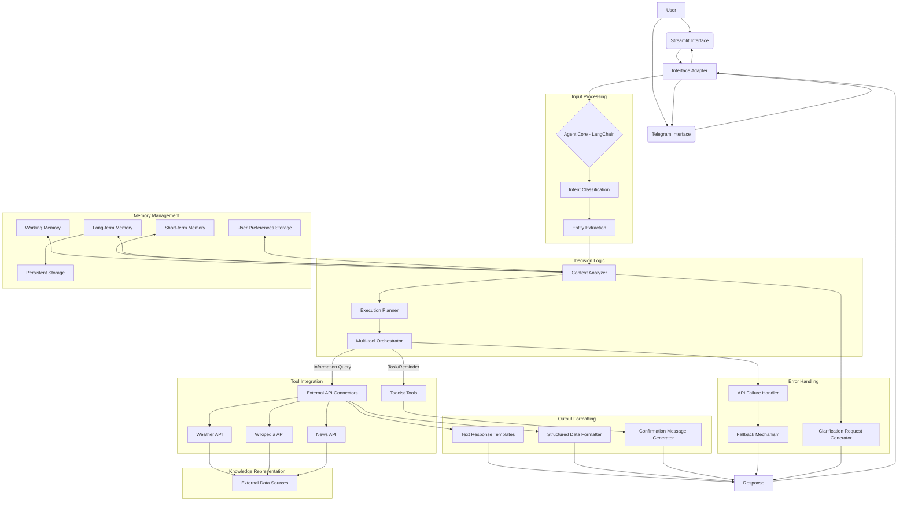

# Day 1: Personal Assistant - Architecture Plan

## High-Level Architecture Diagram



## Architecture Components

### 1. User Interfaces
- **Streamlit Interface**:
  - **Purpose**: Provides a web interface for interaction via browser
  - **Components**:
    - Chat input field
    - Response display area
    - Basic settings panel for user preferences
  - **Interactions**: Receives user queries and displays agent responses
  
- **Telegram Interface**:
  - **Purpose**: Enables mobile access through Telegram messaging app
  - **Components**:
    - Telegram Bot API integration
    - Command handling (e.g., /start, /help)
    - Message formatting for mobile display
  - **Interactions**: Processes incoming Telegram messages and sends responses

- **Interface Adapter**:
  - **Purpose**: Provides a uniform API layer between interfaces and core agent
  - **Components**:
    - Message standardization
    - Response formatting based on target interface
    - Session management
  - **Implementation**:
    ```python
    class InterfaceAdapter:
        def standardize_input(self, raw_input, source):
            """Convert interface-specific input to standard format"""
            if source == "telegram":
                # Extract message text, handle commands, etc.
                return self._process_telegram_input(raw_input)
            elif source == "streamlit":
                # Process web interface input
                return self._process_streamlit_input(raw_input)
                
        def format_output(self, response, target):
            """Format response for specific interface"""
            if target == "telegram":
                # Format for Telegram including potential markdown
                return self._format_for_telegram(response)
            elif target == "streamlit":
                # Format for web display
                return self._format_for_streamlit(response)
    ```

### 2. Input Processing
- **Intent Classification**:
  - Categorizes queries into types: information requests, reminder creation, preferences
  - Uses simple rule-based patterns or LLM classification
- **Entity Extraction**:
  - Identifies key information from user queries (dates, times, locations, search terms)
  - Uses pattern matching or LLM-based extraction

### 3. Decision Logic
- **Context-Aware Router**:
  - Analyzes full conversation context, not just current query
  - Considers user preferences and past interactions
  - Maintains contextual awareness across multiple turns
  - Example implementation:
    ```python
    class ContextAnalyzer:
        def analyze(self, query, conversation_history, user_preferences):
            # Use GPT-4o-mini to identify relevant context
            return {
                "relevant_history": extracted_context,
                "applicable_preferences": relevant_preferences
            }
    ```

- **Intent-based Execution Planning**:
  - Maps intents to execution strategies rather than direct tool calls
  - Selects appropriate execution path based on query complexity
  - Example implementation:
    ```python
    class ExecutionPlanner:
        def plan(self, intent, entities, context):
            # Simple queries → direct execution
            if self.is_simple_query(intent, entities):
                return DirectExecution(self.select_tool(intent))
                
            # Complex queries → decompose into steps
            if self.is_complex_query(intent, entities):
                steps = self.decompose_query(intent, entities, context)
                return SequentialExecution(steps)
                
            # Reminders → Todoist integration
            if self.is_reminder_or_task(intent):
                return TodoistExecution(entities)
    ```

- **Multi-tool Orchestration**:
  - Handles queries requiring multiple API calls in sequence
  - Manages dependencies between consecutive operations
  - Implements fallback mechanisms if primary tools fail
  - Example implementation:
    ```python
    class SequentialExecution:
        def execute(self, steps):
            results = {}
            for step in steps:
                tool_name = step["tool"]
                tool_params = step["parameters"]
                try:
                    results[step["id"]] = self.tools[tool_name].run(**tool_params)
                except Exception:
                    if step.get("fallback"):
                        results[step["id"]] = self.tools[step["fallback"]].run(**tool_params)
            return self.format_results(results)
    ```

- **Todoist Tool Integration**:
  - Implements LangChain custom tool pattern for Todoist integration
  - Provides standardized tool interface consistent with other LangChain tools
  - Enables direct use within LangChain agent framework
  - Example implementation:
    ```python
    from langchain.tools import BaseTool
    from pydantic import BaseModel, Field
    from typing import Optional, Type
    
    class TodoistTaskInput(BaseModel):
        """Input for creating a Todoist task."""
        content: str = Field(description="The content/title of the task")
        due_string: Optional[str] = Field(None, description="Natural language due date (e.g., 'tomorrow at 3pm')")
        priority: Optional[int] = Field(None, description="Priority level (1-4, where 4 is highest)")
        description: Optional[str] = Field(None, description="Detailed description of the task")
    
    class TodoistCreateTool(BaseTool):
        name = "todoist_create_task"
        description = "Create a new task in Todoist with optional due date and priority"
        args_schema: Type[BaseModel] = TodoistTaskInput
        
        def __init__(self, api_token: str):
            super().__init__()
            self.api = TodoistAPI(api_token)
            
        def _run(self, content: str, due_string: Optional[str] = None,
                priority: Optional[int] = None, description: Optional[str] = None) -> str:
            """Create a task in Todoist and return a confirmation message."""
            task = self.api.add_task(
                content=content,
                due_string=due_string,
                priority=priority,
                description=description
            )
            return f"Created task '{content}'" + (f" due {due_string}" if due_string else "")
    ```

### 4. Tool Integration
- **External API Connectors**:
  - Weather API connector for weather queries
  - Wikipedia API connector for knowledge queries
  - News API connector for current events
  - Structured as LangChain tools with standard interfaces
- **Reminder System (via Todoist Tools)**:
  - Set of LangChain custom tools for Todoist API operations:
    - `TodoistCreateTool`: Creates new tasks/reminders
    - `TodoistListTool`: Retrieves upcoming or filtered tasks
    - `TodoistUpdateTool`: Updates existing tasks/reminders
    - `TodoistCompleteTool`: Marks tasks as completed
  - Support for natural language time expressions via Todoist API
  - Priority levels mapping from natural language to Todoist format
  - Consistent tool interface that integrates with agent framework

### 5. Knowledge Representation
- **External Data Sources**:
  - No local knowledge base, relies entirely on external APIs
  - Real-time data retrieval for current information
- **User Preferences**:
  - Simple JSON structure for storing preferences:
    ```json
    {
      "default_location": "New York",
      "temperature_unit": "celsius",
      "news_topics": ["technology", "science"],
      "reminders": [
        {"text": "Call doctor", "time": "2023-06-10T10:00:00"}
      ]
    }
    ```

### 6. Memory Management
- **Hierarchical Memory System**:
  - Tiered approach to conversation memory with three levels:
    - **Working Memory**: Recent conversation turns (last 5-10 exchanges)
    - **Short-term Memory**: Key information from current session
    - **Long-term Memory**: Persistent user preferences and important facts
  - Implementation using LangChain's memory classes:
    ```python
    from langchain.memory import ConversationBufferWindowMemory, ConversationSummaryMemory, VectorStoreRetrieverMemory
    
    class HierarchicalMemory:
        def __init__(self, chat_history_window_size=10):
            # Working memory: Last N conversation turns
            self.working_memory = ConversationBufferWindowMemory(
                k=chat_history_window_size,
                memory_key="chat_history",
                return_messages=True
            )
            
            # Short-term memory: Summarized conversation context
            self.short_term_memory = ConversationSummaryMemory(
                llm=GPT4oMini(),
                memory_key="conversation_summary"
            )
            
            # Long-term memory: Vector store for retrieval of past information
            self.long_term_memory = VectorStoreRetrieverMemory(
                retriever=create_retriever()
            )
    ```

- **Memory Management Strategy**:
  - **Memory Segmentation**: Categorize memories by type (preferences, facts, task history)
  - **Memory Prioritization**: Assess relevance of memories to current context
  - **Memory Refresh**: Periodically update summaries for efficient retrieval
  - Example implementation:
    ```python
    def get_relevant_context(self, query, intent):
        # Get recent conversation from working memory
        recent_context = self.working_memory.load_memory_variables({})
        
        # Get conversation summary from short-term memory
        summary = self.short_term_memory.load_memory_variables({})
        
        # Get relevant facts and preferences from long-term memory
        search_query = self._generate_memory_query(query, intent)
        relevant_facts = self.long_term_memory.retrieve(search_query)
        
        return {
            "recent_context": recent_context,
            "conversation_summary": summary,
            "relevant_facts": relevant_facts
        }
    ```

- **User Preferences Storage**:
  - Structured schema for different preference categories
  - Version control for preference history
  - Default fallbacks for missing preferences
  - Example implementation:
    ```python
    class UserPreferences:
        def __init__(self, user_id, storage_path):
            self.user_id = user_id
            self.storage_path = storage_path
            self.preferences = self._load_preferences()
            self.defaults = self._set_defaults()
            
        def get(self, category, key, default=None):
            """Get a preference with fallback to defaults"""
            return (self.preferences.get(category, {}).get(key) or
                    self.defaults.get(category, {}).get(key) or
                    default)
                    
        def set(self, category, key, value):
            """Set a preference with history tracking"""
            if category not in self.preferences:
                self.preferences[category] = {}
                
            old_value = self.preferences[category].get(key)
            self.preferences[category][key] = value
            
            # Track history of changes
            if "history" not in self.preferences:
                self.preferences["history"] = []
                
            self.preferences["history"].append({
                "timestamp": datetime.now().isoformat(),
                "category": category,
                "key": key,
                "old_value": old_value,
                "new_value": value
            })
            
            self._save_preferences()
    ```

- **Memory Integration with Decision Logic**:
  - Context Analyzer pulls from all memory layers
  - Execution Planner considers past successful strategies
  - Memory-aware tool selection based on past performance
  
- **Cross-Platform Session Management**:
  - Unified memory access across Streamlit and Telegram interfaces
  - User identification across different platforms (using user ID mapping)
  - Example implementation:
    ```python
    class SessionManager:
        def __init__(self):
            self.sessions = {}  # Maps session_id to memory instances
            self.user_platforms = {}  # Maps user_ids to platform session IDs
            
        def get_memory_for_user(self, user_id, platform):
            """Retrieve the same memory instance regardless of platform"""
            # Check if user has any existing sessions
            if user_id in self.user_platforms:
                # Get existing session ID
                session_id = self.user_platforms[user_id]["primary_session_id"]
            else:
                # Create new session ID
                session_id = self._generate_session_id()
                self.user_platforms[user_id] = {
                    "primary_session_id": session_id,
                    "platforms": {}
                }
                
            # Register this platform session
            platform_session_id = f"{platform}:{user_id}"
            self.user_platforms[user_id]["platforms"][platform] = platform_session_id
            
            # Create memory if needed
            if session_id not in self.sessions:
                self.sessions[session_id] = HierarchicalMemory()
                
            return self.sessions[session_id]
    ```

### 7. Output Formatting
- **Text Response Templates**:
  - Predefined templates for consistent responses
  - Example: "The weather in {location} is {condition} with a temperature of {temp}°{unit}."
- **Structured Data Formatter**:
  - Converts API responses into user-friendly formats
  - Handles different data types (weather, facts, etc.)
- **Confirmation Message Generator**:
  - Creates confirmation messages for tasks/reminders
  - Example: "I've set a reminder for you to {task} at {time}."

### 8. Error Handling
- **API Failure Handler**:
  - Gracefully handles API timeouts or failures
  - Provides user-friendly error messages
- **Fallback Mechanism**:
  - Falls back to generic responses when specific tools fail
  - Example: "I couldn't retrieve the weather information. Would you like to try again later?"
- **Clarification Request Generator**:
  - Asks for more information when queries are ambiguous
  - Example: "I'm not sure which city you're asking about. Could you specify the location?"

## Implementation Flow

1. User inputs a query via Streamlit web interface or Telegram chat
2. Query is processed by the Input Processing components:
   - Intent Classification determines query type
   - Entity Extraction pulls out key information
3. Enhanced Decision Logic processes the query:
   - Context Analyzer retrieves relevant information from memory layers
   - Execution Planner determines appropriate execution strategy
   - Complex queries are broken down into sequential steps
   - Tasks and reminders are routed to Todoist Integration
4. If information request:
   - External API Connector retrieves data from appropriate source
   - Structured Data Formatter organizes the response
   - Text Response Template generates natural language response
5. If task/reminder creation:
   - Entity Extraction identifies task and time details
   - TodoistCreateTool is executed with relevant parameters
   - Confirmation Message Generator formats the tool response
6. Error Handling activates if any step fails
7. Final response is formatted by Interface Adapter for target platform
8. Response is displayed to user in Streamlit UI or Telegram chat

## Dependency Diagram

```
LangChain
├── OpenAI API (GPT-4o-mini)
├── LangChain Tools
│   ├── WeatherAPI Tool
│   ├── WikipediaAPI Tool
│   ├── NewsAPI Tool
│   └── TodoistAPI Tool (using Todoist API)
├── Memory Components
│   ├── HierarchicalMemory (custom)
│   │   ├── ConversationBufferWindowMemory
│   │   ├── ConversationSummaryMemory
│   │   └── VectorStoreRetrieverMemory
│   └── UserPreferences (custom)
└── Agent Components
    ├── ContextAwareRouter (custom)
    ├── ExecutionPlanner (custom)
    ├── TodoistTools (LangChain BaseTool implementations)
    └── ResponseFormatter (custom)

User Interfaces
├── Streamlit Interface
│   ├── Chat Interface
│   └── Settings Panel
├── Telegram Interface
│   ├── Bot API Client
│   └── Command Handlers
└── Interface Adapter
    ├── Input Standardization
    └── Response Formatting
```

## Framework Selection Rationale

**LangChain** is ideal for this Personal Assistant because:
1. It provides built-in tools for common APIs (weather, Wikipedia)
2. It offers simple memory management capabilities
3. It allows for easy agent construction with rule-based routing
4. It integrates well with OpenAI's GPT models
5. It's designed specifically for this type of conversational agent

## Tool Integration Strategy

For the initial implementation, we recommend using **standard LangChain tools** rather than MCP servers for simplicity, with the following approach:

1. **Direct API Integration**: Use LangChain's built-in tools where available (e.g., WikipediaAPIWrapper)
2. **Custom Tool Creation**: Create custom LangChain tools following the BaseTool pattern:
   ```python
   # Example pattern for all custom tools
   class CustomTool(BaseTool):
       name = "tool_name"
       description = "What the tool does and when to use it"
       args_schema: Type[BaseModel] = InputSchema
       
       def _run(self, **kwargs) -> str:
           # Implementation logic here
           return result
   ```
3. **Todoist Integration**: Implement a suite of Todoist tools using the LangChain custom tool pattern
4. **Future MCP Integration**: Design the Tool Abstraction Layer to support future migration to MCP servers

This approach allows for:
- Faster initial development
- Simplified debugging
- Easier testing
- Clear upgrade path to more sophisticated MCP-based tools in future iterations

## Scaling Considerations

As mentioned in the agent-spec.md, future enhancements could include:
1. Replacing local JSON storage with a persistent database
2. Enhancing vector store memory with embeddings for better retrieval
3. Adding additional specialized APIs
4. Implementing user authentication for multi-user support
5. Adding additional interface options (voice, email, etc.)
6. Cross-platform session management for continuous conversations
7. Migrating to MCP servers for more sophisticated tool integration