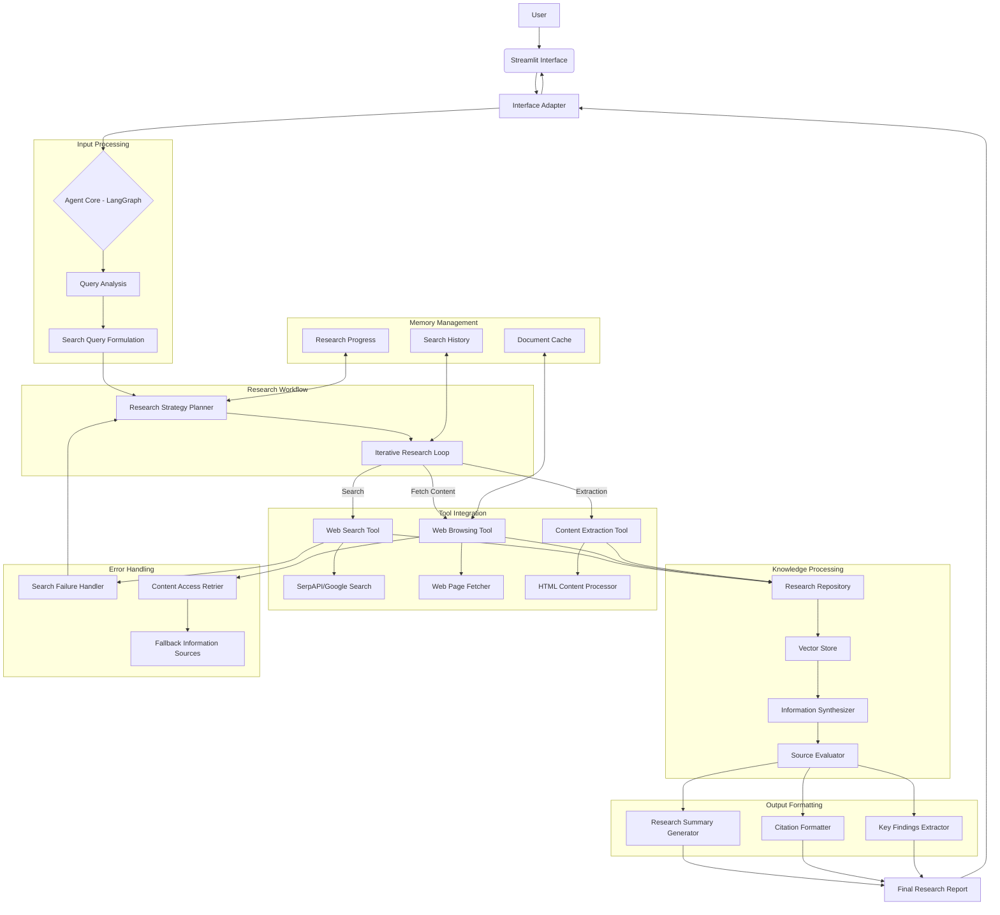

# Day 2: Research Assistant - Architecture Plan

## 1. Overview

The Research Assistant is designed to conduct comprehensive web research on user-specified topics, synthesize information from multiple sources, and provide summarized findings with citations. It uses an iterative research process to ensure thorough coverage and high-quality information synthesis.

## 2. High-Level Architecture Diagram



## 3. Core Components

### 3.1 Framework Selection

The Research Assistant will use a hybrid approach with three frameworks:

- **LangGraph**: For orchestrating the research workflow and managing state transitions
- **LlamaIndex**: For document loading, parsing, indexing, and retrieval
- **LangChain**: For specialized tools and utilities that enhance research capabilities

This hybrid approach leverages LangGraph's strength in workflow management, LlamaIndex's capabilities in knowledge management and retrieval, and LangChain's extensive tool ecosystem for web research.

### 3.2 Architecture Components

#### 3.2.1 User Interface

- **Streamlit Interface**:
  - Research query input field
  - Research parameters selection (depth, sources preference, etc.)
  - Progress indicators for long-running research
  - Structured display of research findings with expandable sections
  - Citation viewer with links to sources

#### 3.2.2 Input Processing

- **Query Analysis**:
  - Identifies key research topics and entities
  - Classifies the query type (factual, comparative, exploratory, etc.)
  - Determines domain-specific requirements
  - Example Implementation:

```python
class QueryAnalyzer:
    def __init__(self, llm):
        self.llm = llm
        self.prompt_template = """
        Analyze the following research query:
        {query}

        Identify:
        1. Main topic(s)
        2. Key entities
        3. Query type (factual, comparative, exploratory, etc.)
        4. Domain-specific requirements
        5. Time constraints or recency requirements
        """

    def analyze(self, query):
        response = self.llm.invoke(self.prompt_template.format(query=query))
        # Parse the response to extract structured information
        return {
            "topics": extracted_topics,
            "entities": extracted_entities,
            "query_type": query_type,
            "domain": domain,
            "time_constraints": time_constraints
        }
```

- **Search Query Formulation**:
  - Transforms user query into effective search queries
  - Creates multiple search variations for comprehensive coverage
  - Optimizes for information discovery based on query type
  - Example Implementation:

```python
class SearchQueryFormulator:
    def __init__(self, llm):
        self.llm = llm
        self.prompt_template = """
        Based on the research query analysis:
        {analysis}

        Formulate 3-5 effective search queries that will:
        1. Cover different aspects of the topic
        2. Target high-quality sources
        3. Use domain-specific terminology where appropriate
        4. Address different time periods if temporal information is needed
        """

    def formulate_queries(self, analysis):
        response = self.llm.invoke(self.prompt_template.format(analysis=analysis))
        # Parse the response to extract a list of search queries
        return extracted_queries
```

#### 3.2.3 Research Workflow

- **Research Strategy Planner**:
  - Determines the overall research approach
  - Plans iterative search refinement strategy
  - Sets criteria for sufficient research coverage
  - Example Implementation:

```python
class ResearchStrategyPlanner:
    def __init__(self, llm):
        self.llm = llm
        self.prompt_template = """
        Based on the query: "{query}"
        And the analysis: {analysis}

        Develop a research strategy that includes:
        1. The number of sources to consult (minimum)
        2. Types of sources to prioritize
        3. Criteria for determining when enough information has been gathered
        4. Approach for handling conflicting information
        5. Sequence of search operations to perform
        """

    def create_strategy(self, query, analysis):
        response = self.llm.invoke(self.prompt_template.format(
            query=query,
            analysis=analysis
        ))
        # Parse the response to extract a structured research strategy
        return {
            "min_sources": min_sources,
            "source_priorities": source_priorities,
            "completion_criteria": completion_criteria,
            "conflict_resolution": conflict_resolution,
            "search_sequence": search_sequence
        }
```

- **Iterative Research Loop**:
  - Core LangGraph workflow for iterative research
  - Manages state transitions between search, browsing, and extraction
  - Implements decision points for continuing or concluding research
  - Example Implementation:

```python
from langgraph.graph import StateGraph, END
from typing import TypedDict, List, Dict, Any

# Define state schema
class ResearchState(TypedDict):
    query: str
    analysis: Dict[str, Any]
    strategy: Dict[str, Any]
    search_queries: List[str]
    current_query_index: int
    search_results: List[Dict[str, Any]]
    browsed_pages: List[Dict[str, Any]]
    extracted_content: List[Dict[str, Any]]
    synthesized_information: Dict[str, Any]
    research_complete: bool
    next_step: str

# Create nodes for the research workflow
def perform_search(state: ResearchState) -> ResearchState:
    """Execute the current search query and update results."""
    current_query = state["search_queries"][state["current_query_index"]]
    search_results = search_tool.search(current_query)

    updated_results = state["search_results"] + search_results

    return {
        **state,
        "search_results": updated_results,
        "next_step": "browse_content"
    }

def browse_content(state: ResearchState) -> ResearchState:
    """Browse and fetch content from search results."""
    # Get URLs that haven't been browsed yet
    new_urls = [
        result["url"] for result in state["search_results"]
        if not any(bp["url"] == result["url"] for bp in state["browsed_pages"])
    ]

    # Browse top N unvisited pages
    browsed_pages = []
    for url in new_urls[:3]:  # Process 3 at a time
        try:
            page_content = browsing_tool.fetch_content(url)
            browsed_pages.append({
                "url": url,
                "title": page_content.get("title", ""),
                "content": page_content.get("content", ""),
                "timestamp": datetime.now().isoformat()
            })
        except Exception as e:
            # Log the error but continue with other URLs
            print(f"Error browsing {url}: {e}")

    updated_browsed_pages = state["browsed_pages"] + browsed_pages

    return {
        **state,
        "browsed_pages": updated_browsed_pages,
        "next_step": "extract_information"
    }

def extract_information(state: ResearchState) -> ResearchState:
    """Extract relevant information from browsed pages."""
    # Get pages that haven't been extracted yet
    new_pages = [
        page for page in state["browsed_pages"]
        if not any(ec["url"] == page["url"] for ec in state["extracted_content"])
    ]

    extracted_content = []
    for page in new_pages:
        extracted = extraction_tool.extract_relevant_content(
            page["content"],
            state["query"]
        )

        if extracted:
            extracted_content.append({
                "url": page["url"],
                "title": page["title"],
                "extracted_text": extracted,
                "timestamp": datetime.now().isoformat()
            })

    updated_extracted_content = state["extracted_content"] + extracted_content

    return {
        **state,
        "extracted_content": updated_extracted_content,
        "next_step": "evaluate_progress"
    }

def evaluate_progress(state: ResearchState) -> ResearchState:
    """Determine if enough research has been done or if more is needed."""
    # Check if we've satisfied the research strategy criteria

    # 1. Have we reached minimum number of sources?
    sources_gathered = len(state["extracted_content"])
    min_sources = state["strategy"]["min_sources"]

    # 2. Have we searched all queries?
    all_queries_searched = state["current_query_index"] >= len(state["search_queries"]) - 1

    # 3. Do we have sufficient information coverage?
    # This requires LLM evaluation
    information_sufficient = evaluator.check_information_sufficiency(
        state["extracted_content"],
        state["query"],
        state["analysis"]
    )

    if (sources_gathered >= min_sources and information_sufficient) or \
       (all_queries_searched and sources_gathered > 0):
        return {
            **state,
            "research_complete": True,
            "next_step": "synthesize"
        }
    else:
        # More research needed
        return {
            **state,
            "current_query_index": (state["current_query_index"] + 1) % len(state["search_queries"]),
            "next_step": "perform_search"
        }

def synthesize_information(state: ResearchState) -> ResearchState:
    """Synthesize the extracted information into a coherent summary."""
    synthesized = synthesizer.synthesize(
        state["extracted_content"],
        state["query"],
        state["analysis"]
    )

    return {
        **state,
        "synthesized_information": synthesized,
        "next_step": "generate_report"
    }

def generate_report(state: ResearchState) -> ResearchState:
    """Generate the final research report."""
    report = report_generator.generate(
        state["synthesized_information"],
        state["extracted_content"],
        state["query"]
    )

    return {
        **state,
        "final_report": report,
        "next_step": "end"
    }

# Create the LangGraph
research_graph = StateGraph(ResearchState)

# Add nodes
research_graph.add_node("perform_search", perform_search)
research_graph.add_node("browse_content", browse_content)
research_graph.add_node("extract_information", extract_information)
research_graph.add_node("evaluate_progress", evaluate_progress)
research_graph.add_node("synthesize_information", synthesize_information)
research_graph.add_node("generate_report", generate_report)

# Define edges
def router(state: ResearchState) -> str:
    return state["next_step"]

research_graph.add_conditional_edges(
    "perform_search",
    router,
    {
        "browse_content": "browse_content"
    }
)

research_graph.add_conditional_edges(
    "browse_content",
    router,
    {
        "extract_information": "extract_information"
    }
)

research_graph.add_conditional_edges(
    "extract_information",
    router,
    {
        "evaluate_progress": "evaluate_progress"
    }
)

research_graph.add_conditional_edges(
    "evaluate_progress",
    router,
    {
        "perform_search": "perform_search",
        "synthesize": "synthesize_information"
    }
)

research_graph.add_conditional_edges(
    "synthesize_information",
    router,
    {
        "generate_report": "generate_report"
    }
)

research_graph.add_conditional_edges(
    "generate_report",
    router,
    {
        "end": END
    }
)

# Compile the graph
workflow = research_graph.compile()
```

#### 3.2.4 Tool Integration

- **Web Search Tool**:
  - Primary implementation using Exa Search (preferred)
  - Alternative implementation using SerpAPI or Google Search API
  - Extracts structured results from search queries
  - Handles pagination and result filtering
  - Example Implementation:

```python
class WebSearchTool:
    def __init__(self, api_key, search_engine="exa"):
        self.api_key = api_key
        self.search_engine = search_engine

    def search(self, query, num_results=10):
        if self.search_engine == "exa":
            return self._search_exa(query, num_results)
        elif self.search_engine == "serpapi":
            return self._search_serpapi(query, num_results)
        else:
            return self._search_google(query, num_results)

    def _search_exa(self, query, num_results):
        from langchain_exa import ExaSearch

        search_tool = ExaSearch(api_key=self.api_key)
        results = search_tool.search(query, num_results=num_results)

        return [
            {
                "title": result.title,
                "url": result.url,
                "snippet": result.text,
                "source": "exa"
            }
            for result in results
        ]

    def _search_serpapi(self, query, num_results):
        from serpapi import GoogleSearch

        search = GoogleSearch({
            "q": query,
            "api_key": self.api_key,
            "num": num_results
        })

        results = search.get_dict()

        return [
            {
                "title": result.get("title", ""),
                "url": result.get("link", ""),
                "snippet": result.get("snippet", ""),
                "source": "serpapi"
            }
            for result in results.get("organic_results", [])
        ]
```

- **Web Browsing Tool**:
  - Fetches and extracts content from web pages
  - Uses Playwright for JavaScript-heavy sites
  - Handles different content types and formats
  - Example Implementation:

```python
class WebBrowsingTool:
    def __init__(self, use_playwright=True):
        self.use_playwright = use_playwright

    def fetch_content(self, url):
        if self.use_playwright:
            return self._fetch_with_playwright(url)
        else:
            return self._fetch_with_requests(url)

    def _fetch_with_playwright(self, url):
        from playwright.sync_api import sync_playwright

        with sync_playwright() as p:
            browser = p.chromium.launch(headless=True)
            page = browser.new_page()
            try:
                page.goto(url, wait_until="networkidle", timeout=60000)

                # Extract the main content
                title = page.title()
                content = page.content()

                browser.close()
                return {
                    "title": title,
                    "content": content,
                    "url": url
                }
            except Exception as e:
                browser.close()
                raise e
```

- **Content Extraction Tool**:
  - Uses LangChain document loaders to process web content
  - Identifies and extracts key information
  - Filters out ads, navigation, etc.
  - Chunks content for efficient processing
  - Example Implementation:

```python
class ContentExtractionTool:
    def __init__(self, llm):
        self.llm = llm
        from langchain_text_splitters import RecursiveCharacterTextSplitter
        self.text_splitter = RecursiveCharacterTextSplitter(
            chunk_size=1000,
            chunk_overlap=200
        )

    def extract_relevant_content(self, url, query):
        # Use LangChain's WebBaseLoader to fetch and process the content
        from langchain_community.document_loaders import WebBaseLoader

        try:
            # Load content from URL
            loader = WebBaseLoader(url)
            documents = loader.load()

            # Split into manageable chunks
            chunks = self.text_splitter.split_documents(documents)

            # Combine chunks into a single text (limiting total size)
            combined_text = ""
            total_length = 0
            max_length = 10000  # Limit to avoid token issues

            for chunk in chunks:
                if total_length + len(chunk.page_content) > max_length:
                    break
                combined_text += chunk.page_content + "\n\n"
                total_length += len(chunk.page_content)

            # Use the LLM to extract the most relevant parts
            prompt = f"""
            Based on the research query: "{query}"

            Extract the most relevant information from the following web page content:
            {combined_text}

            Extract only information that is directly relevant to the query.
            Format the output as plain text with clear paragraphs.
            Include any important facts, figures, dates, or statistics.
            """

            extracted_content = self.llm.invoke(prompt)
            return extracted_content

        except Exception as e:
            # Fallback to traditional HTML processing if WebBaseLoader fails
            return self._fallback_extraction(url, query)

    def _fallback_extraction(self, url, query):
        # Fallback method using requests and BeautifulSoup
        import requests
        from bs4 import BeautifulSoup

        try:
            response = requests.get(url, headers={
                'User-Agent': 'Mozilla/5.0 (Windows NT 10.0; Win64; x64) AppleWebKit/537.36'
            })
            html_content = response.text
            clean_text = self._clean_html(html_content)

            prompt = f"""
            Based on the research query: "{query}"

            Extract the most relevant information from the following web page content:
            {clean_text[:10000]}  # Limit to avoid token issues

            Extract only information that is directly relevant to the query.
            Format the output as plain text with clear paragraphs.
            Include any important facts, figures, dates, or statistics.
            """

            extracted_content = self.llm.invoke(prompt)
            return extracted_content
        except Exception as e:
            return f"Failed to extract content from {url}: {str(e)}"

    def _clean_html(self, html_content):
        # Use libraries like BeautifulSoup to clean the HTML
        from bs4 import BeautifulSoup

        soup = BeautifulSoup(html_content, 'html.parser')

        # Remove script and style elements
        for script in soup(["script", "style", "header", "footer", "nav"]):
            script.extract()

        # Get text
        text = soup.get_text()

        # Break into lines and remove leading and trailing space
        lines = (line.strip() for line in text.splitlines())
        # Break multi-headlines into a line each
        chunks = (phrase.strip() for line in lines for phrase in line.split("  "))
        # Drop blank lines
        text = '\n'.join(chunk for chunk in chunks if chunk)

        return text
```

#### 3.2.5 Knowledge Processing

- **Research Repository**:
  - Central storage for all research artifacts using LangChain's vector stores
  - Tracks sources, content, and metadata
  - Enables efficient retrieval and reference
  - Example Implementation:

```python
from langchain_community.vectorstores import Chroma
from langchain_openai import OpenAIEmbeddings
from datetime import datetime

class ResearchRepository:
    def __init__(self, embedding_model=None, persist_directory="./research_db"):
        # Initialize embedding model (default to OpenAI if none provided)
        self.embedding_model = embedding_model or OpenAIEmbeddings()

        # Initialize vector store with Chroma
        self.vector_store = Chroma(
            persist_directory=persist_directory,
            embedding_function=self.embedding_model
        )

        self.documents = []
        self.sources = []

    def add_document(self, document, source):
        # Add to document list
        doc_id = len(self.documents)
        self.documents.append({
            "id": doc_id,
            "content": document,
            "source_id": len(self.sources)
        })

        # Add to sources list
        source_id = len(self.sources)
        self.sources.append({
            "id": source_id,
            "url": source.get("url", ""),
            "title": source.get("title", ""),
            "accessed_at": datetime.now().isoformat()
        })

        # Add to vector store
        self.vector_store.add_texts(
            texts=[document],
            metadatas=[{
                "doc_id": doc_id,
                "source_id": source_id,
                "url": source.get("url", ""),
                "title": source.get("title", ""),
                "timestamp": datetime.now().isoformat()
            }]
        )

        return doc_id

    def query(self, query_text, top_k=5):
        """Find the most relevant documents for a query."""
        docs = self.vector_store.similarity_search(query_text, k=top_k)

        results = []
        for doc in docs:
            source_id = doc.metadata.get("source_id")
            if source_id is not None:
                source_id = int(source_id)  # Convert to int if it's stored as string

            results.append({
                "content": doc.page_content,
                "source": self.sources[source_id] if source_id is not None and source_id < len(self.sources) else None,
                "relevance_score": doc.metadata.get("score", 1.0),
                "url": doc.metadata.get("url", ""),
                "title": doc.metadata.get("title", "")
            })

        return results

    def save(self):
        """Persist the vector store to disk."""
        self.vector_store.persist()

    def load(self):
        """Load the vector store from disk."""
        # Chroma automatically loads from the persist_directory
        pass
```

- **Information Synthesizer**:
  - Combines information from multiple sources
  - Resolves conflicts between sources
  - Creates a coherent narrative from research findings
  - Example Implementation:

```python
class InformationSynthesizer:
    def __init__(self, llm):
        self.llm = llm

    def synthesize(self, extracted_contents, query, query_analysis):
        # Prepare the content for synthesis
        formatted_contents = []

        for item in extracted_contents:
            formatted_contents.append(f"""
            SOURCE: {item['title']} ({item['url']})
            CONTENT:
            {item['extracted_text']}
            """)

        combined_content = "\n\n".join(formatted_contents)

        # Use the LLM to synthesize
        prompt = f"""
        RESEARCH QUERY: {query}

        EXTRACTED INFORMATION FROM MULTIPLE SOURCES:
        {combined_content}

        TASK:
        Synthesize the above information into a coherent research summary that:
        1. Addresses the main aspects of the research query
        2. Integrates information from multiple sources
        3. Highlights areas of consensus among sources
        4. Notes any contradictions or disagreements between sources
        5. Identifies any gaps in the collected information

        FORMAT THE OUTPUT AS:

        ## Summary
        [Overall synthesis of the research findings]

        ## Key Points
        * [Key point 1]
        * [Key point 2]
        * [Key point 3]
        ...

        ## Areas of Consensus
        [Describe what most or all sources agree on]

        ## Conflicting Information
        [Note any contradictions between sources]

        ## Information Gaps
        [Identify aspects of the query that weren't fully addressed]
        """

        synthesis = self.llm.invoke(prompt)
        return synthesis
```

- **Source Evaluator**:
  - Assesses source credibility and relevance
  - Identifies potential biases or limitations
  - Ranks sources by quality and reliability
  - Example Implementation:

```python
class SourceEvaluator:
    def __init__(self, llm):
        self.llm = llm

    def evaluate_sources(self, sources):
        evaluations = []

        for source in sources:
            prompt = f"""
            Evaluate the credibility and relevance of the following source:

            TITLE: {source['title']}
            URL: {source['url']}
            EXCERPT: {source['extracted_text'][:500]}

            Consider the following factors:
            1. Is this from a reputable website or organization?
            2. Is it likely to be peer-reviewed or edited content?
            3. Does it appear to be objective or biased?
            4. Is it primary or secondary research?
            5. How recent is the information likely to be?

            For each factor, provide a rating from 1-5 and brief justification.
            Then provide an overall credibility score from 1-5.
            """

            evaluation = self.llm.invoke(prompt)

            # Parse the evaluation to extract ratings
            # (In practice, you'd implement a more robust parser)

            evaluations.append({
                "source": source,
                "evaluation": evaluation,
                "credibility_score": self._extract_score(evaluation)
            })

        return evaluations

    def _extract_score(self, evaluation_text):
        # Simple regex to extract a score from text like "overall credibility score: 4"
        import re
        match = re.search(r'overall.+?score:?\s*(\d+)', evaluation_text, re.IGNORECASE)
        if match:
            return int(match.group(1))
        return 3  # Default middle score if extraction fails
```

#### 3.2.6 Memory Management

- **Search History Management**:
  - Tracks all search queries and results
  - Prevents redundant searches
  - Enables intelligent query refinement
  - Example Implementation:

```python
class SearchHistoryManager:
    def __init__(self):
        self.history = []

    def add_search(self, query, results):
        """Add a search query and its results to history."""
        search_record = {
            "query": query,
            "timestamp": datetime.now().isoformat(),
            "result_count": len(results),
            "result_urls": [r["url"] for r in results]
        }

        self.history.append(search_record)

    def get_search_history(self):
        """Get all search history."""
        return self.history

    def has_query_been_searched(self, query):
        """Check if an identical or very similar query has been searched."""
        # Simple exact match check
        return any(record["query"] == query for record in self.history)

    def get_related_searches(self, query):
        """Get previous searches related to the current query."""
        # This implementation would benefit from embedding-based similarity
        # For now, using simple substring matching
        return [
            record for record in self.history
            if query.lower() in record["query"].lower() or
               record["query"].lower() in query.lower()
        ]
```

- **Document Cache**:
  - Stores fetched web pages locally
  - Reduces redundant network requests
  - Provides persistence across sessions
  - Example Implementation:

```python
class DocumentCache:
    def __init__(self, cache_dir="./cache"):
        import os
        self.cache_dir = cache_dir
        os.makedirs(cache_dir, exist_ok=True)

    def get_cached_document(self, url):
        """Retrieve a document from cache if it exists."""
        import hashlib
        import os
        import json

        # Create a filename from the URL
        filename = hashlib.md5(url.encode()).hexdigest() + ".json"
        filepath = os.path.join(self.cache_dir, filename)

        if os.path.exists(filepath):
            try:
                with open(filepath, 'r') as f:
                    return json.load(f)
            except Exception as e:
                print(f"Error reading from cache: {e}")
                return None

        return None

    def cache_document(self, url, document):
        """Cache a document for future use."""
        import hashlib
        import os
        import json

        # Create a filename from the URL
        filename = hashlib.md5(url.encode()).hexdigest() + ".json"
        filepath = os.path.join(self.cache_dir, filename)

        try:
            with open(filepath, 'w') as f:
                # Store document with metadata
                cache_entry = {
                    "url": url,
                    "title": document.get("title", ""),
                    "content": document.get("content", ""),
                    "cached_at": datetime.now().isoformat()
                }
                json.dump(cache_entry, f)
                return True
        except Exception as e:
            print(f"Error writing to cache: {e}")
            return False
```

#### 3.2.7 Output Formatting

- **Research Summary Generator**:
  - Creates structured research reports
  - Adapts level of detail to query complexity
  - Produces clear, concise summaries
  - Example Implementation:

```python
class ResearchSummaryGenerator:
    def __init__(self, llm):
        self.llm = llm

    def generate_summary(self, synthesized_info, query, sources):
        # Format sources for citation
        formatted_sources = []
        for idx, source in enumerate(sources, 1):
            formatted_sources.append(f"[{idx}] {source['title']}. {source['url']}")

        sources_text = "\n".join(formatted_sources)

        prompt = f"""
        RESEARCH QUERY: {query}

        SYNTHESIZED INFORMATION:
        {synthesized_info}

        SOURCES USED:
        {sources_text}

        Based on the above research, generate a comprehensive research summary that:
        1. Directly addresses the original query
        2. Is well-organized with sections and bullet points for clarity
        3. Cites sources using the [n] notation throughout the text
        4. Highlights the most important findings
        5. Provides a balanced view if conflicting information exists

        FORMAT:

        # Research Summary: [Query]

        ## Key Findings
        * Finding 1 [n]
        * Finding 2 [n, m]
        ...

        ## Detailed Analysis
        [Comprehensive analysis with appropriate sections]

        ## Additional Information
        [Any relevant context or caveats]

        ## Sources
        [Sources formatted as already provided]
        """

        summary = self.llm.invoke(prompt)
        return summary
```

- **Citation Formatter**:
  - Standardizes source citations
  - Supports different citation styles
  - Links citations to original sources
  - Example Implementation:

```python
class CitationFormatter:
    def __init__(self, citation_style="apa"):
        self.citation_style = citation_style

    def format_citations(self, sources):
        """Generate properly formatted citations for sources."""
        formatted_citations = []

        for source in sources:
            url = source.get("url", "")
            title = source.get("title", "")
            accessed_date = source.get("accessed_at", datetime.now().isoformat())

            # Parse ISO date string to datetime
            if isinstance(accessed_date, str):
                accessed_date = datetime.fromisoformat(accessed_date)

            # Format according to citation style
            if self.citation_style == "apa":
                citation = self._format_apa(title, url, accessed_date)
            elif self.citation_style == "mla":
                citation = self._format_mla(title, url, accessed_date)
            else:
                citation = self._format_simple(title, url, accessed_date)

            formatted_citations.append({
                "source_id": source.get("id"),
                "formatted_citation": citation,
                "url": url
            })

        return formatted_citations

    def _format_apa(self, title, url, accessed_date):
        """Format citation in APA style."""
        formatted_date = accessed_date.strftime("%Y, %B %d")
        return f"{title}. Retrieved {formatted_date}, from {url}"

    def _format_mla(self, title, url, accessed_date):
        """Format citation in MLA style."""
        formatted_date = accessed_date.strftime("%d %b. %Y")
        return f'"{title}." {url}. Accessed {formatted_date}.'

    def _format_simple(self, title, url, accessed_date):
        """Format citation in a simple style."""
        formatted_date = accessed_date.strftime("%Y-%m-%d")
        return f"{title}. {url} (Accessed: {formatted_date})"
```

#### 3.2.8 Error Handling

- **Search Failure Handler**:
  - Manages API errors and rate limits
  - Implements exponential backoff for retries
  - Falls back to alternative search engines
  - Example Implementation:

```python
class SearchFailureHandler:
    def __init__(self, max_retries=3, backoff_factor=2):
        self.max_retries = max_retries
        self.backoff_factor = backoff_factor

    def handle_search_failure(self, search_tool, query, error):
        """Handle failures in the search process with retries and fallbacks."""
        search_successful = False
        results = []

        # Try with retries and exponential backoff
        for attempt in range(self.max_retries):
            try:
                # Wait with exponential backoff
                if attempt > 0:
                    wait_time = self.backoff_factor ** attempt
                    time.sleep(wait_time)

                # Try searching
                results = search_tool.search(query)
                search_successful = True
                break
            except Exception as e:
                print(f"Search attempt {attempt+1} failed: {e}")

        # If all retries failed, try fallback strategies
        if not search_successful:
            results = self._fallback_search_strategies(query, error)

        return results

    def _fallback_search_strategies(self, query, original_error):
        """Implement fallback search strategies when primary search fails."""
        # Strategies could include:
        # 1. Try alternative search engines
        # 2. Modify the query to be simpler
        # 3. Use cached results if available
        # 4. Return a minimal placeholder result

        # For this implementation, return a placeholder
        return [{
            "title": "Search Error",
            "url": "",
            "snippet": f"Could not perform search due to: {str(original_error)}",
            "is_fallback": True
        }]
```

- **Content Access Retrier**:
  - Handles website access failures
  - Tries alternative access methods
  - Implements wait strategies for rate-limited sites
  - Example Implementation:

```python
class ContentAccessRetrier:
    def __init__(self, max_retries=3, backoff_factor=2):
        self.max_retries = max_retries
        self.backoff_factor = backoff_factor

    def fetch_with_retry(self, browsing_tool, url):
        """Fetch content with retries and fallback strategies."""
        for attempt in range(self.max_retries):
            try:
                # Wait with exponential backoff if not first attempt
                if attempt > 0:
                    wait_time = self.backoff_factor ** attempt
                    time.sleep(wait_time)

                # Try fetching content
                result = browsing_tool.fetch_content(url)
                return result
            except Exception as e:
                print(f"Fetch attempt {attempt+1} for {url} failed: {e}")

        # If all retries fail, try alternative approaches
        return self._try_alternative_access_methods(url)

    def _try_alternative_access_methods(self, url):
        """Try alternative methods to access content."""
        # Methods could include:
        # 1. Try with a different User-Agent
        # 2. Try with a simple requests approach if Playwright failed
        # 3. Check for cached versions via archive.org
        # 4. Extract from Google's cached version

        # First, try with simple requests if that's not what we used already
        try:
            import requests
            from bs4 import BeautifulSoup

            headers = {'User-Agent': 'Mozilla/5.0 (Windows NT 10.0; Win64; x64) AppleWebKit/537.36'}
            response = requests.get(url, headers=headers, timeout=10)

            if response.status_code == 200:
                soup = BeautifulSoup(response.text, 'html.parser')
                title = soup.title.string if soup.title else "Unknown Title"

                return {
                    "title": title,
                    "content": response.text,
                    "url": url,
                    "access_method": "requests_fallback"
                }
        except Exception as e:
            print(f"Simple requests fallback failed: {e}")

        # Try archive.org
        try:
            archive_url = f"https://web.archive.org/web/{url}"
            headers = {'User-Agent': 'Mozilla/5.0 (Windows NT 10.0; Win64; x64) AppleWebKit/537.36'}
            response = requests.get(archive_url, headers=headers, timeout=15)

            if response.status_code == 200:
                soup = BeautifulSoup(response.text, 'html.parser')
                title = soup.title.string if soup.title else "Archived Version"

                return {
                    "title": title,
                    "content": response.text,
                    "url": url,
                    "access_method": "archive_org"
                }
        except Exception as e:
            print(f"Archive.org fallback failed: {e}")

        # Return minimal placeholder if all fallbacks fail
        return {
            "title": "Access Failed",
            "content": "Could not access the content of this page.",
            "url": url,
            "access_method": "failed"
        }
```

## 4. Implementation Flow

1. **User initiates research**:
   - User enters a research query into the Streamlit interface
   - Optionally sets research parameters (depth, preferred sources, etc.)

2. **Input Processing**:
   - Query Analysis parses and categorizes the research query
   - Search Query Formulation creates effective search queries

3. **Research Strategy Planning**:
   - Research Strategy Planner determines the research approach
   - Sets criteria for sufficient information gathering

4. **Iterative Research Loop**:
   - Web Search Tool executes search queries
   - Web Browsing Tool accesses relevant pages
   - Content Extraction Tool extracts relevant information
   - Research Repository stores and organizes findings
   - Progress is evaluated against completion criteria
   - Loop continues until sufficient information is gathered

5. **Knowledge Synthesis**:
   - Source Evaluator assesses source credibility
   - Information Synthesizer combines information from multiple sources
   - Conflicts and gaps are identified

6. **Report Generation**:
   - Research Summary Generator creates a structured report
   - Citation Formatter standardizes source references
   - Final report is returned to the user

7. **Error Handling** (throughout the process):
   - Search Failure Handler manages API errors
   - Content Access Retrier handles website access issues
   - Fallback information sources are used if needed

## 5. Hybrid Framework Integration

For this Research Assistant, we'll leverage LangGraph, LlamaIndex, and LangChain in complementary ways:

### LangGraph Components
- The overall research workflow orchestration
- State management between research steps
- Conditional branching for iterative research
- Decision points for research completion

### LlamaIndex Components
- Document loading and processing
- Text chunking and embedding
- Vector storage for research repository
- Retrieval for relevant document selection
- Query engines for information synthesis

### LangChain Components
- **Web Search Tools**: For finding relevant information across the web
  - `ExaSearch`: Primary search tool for high-quality web results (preferred over SerpAPI)
  - `TavilySearchResults`: Alternative search tool for research-oriented queries
  - `WikipediaQueryRun`: For gathering background information and factual data
  - `ArxivQueryRun`: For academic and scientific research papers
- **Document Processing Tools**: For handling web content
  - `WebBaseLoader`: For fetching and processing web pages
  - `RecursiveUrlLoader`: For crawling linked pages on a website
  - `RecursiveCharacterTextSplitter`: For chunking extracted content
- **Vector Store Tools**: For storing and retrieving research information
  - `Chroma`: For efficient vector storage of research content
  - `OpenAIEmbeddings`: For high-quality text embeddings
- **Structured Output Tools**: For consistent data handling
  - `StructuredOutputParser`: For parsing search results and extracted content

Example of hybrid integration:

```python
from langgraph.graph import StateGraph
from llama_index import VectorStoreIndex, Document
from llama_index.node_parser import SentenceSplitter
from llama_index.embeddings import GeminiEmbedding
from llama_index.vector_stores import ChromaVectorStore
from langchain_community.vectorstores import Chroma
from langchain_openai import OpenAIEmbeddings
from langchain_exa import ExaSearch
from langchain_community.document_loaders import WebBaseLoader
from langchain_text_splitters import RecursiveCharacterTextSplitter
from langchain_community.tools import WikipediaQueryRun, ArxivQueryRun
from langchain_community.utilities import WikipediaAPIWrapper, ArxivAPIWrapper

# LangChain setup for search tools
exa_search = ExaSearch(api_key="your-exa-api-key")
wikipedia_tool = WikipediaQueryRun(api_wrapper=WikipediaAPIWrapper())
arxiv_tool = ArxivQueryRun(api_wrapper=ArxivAPIWrapper())

# LangChain setup for document processing
text_splitter = RecursiveCharacterTextSplitter(chunk_size=1000, chunk_overlap=200)
embeddings = OpenAIEmbeddings()
langchain_vectorstore = Chroma(embedding_function=embeddings, persist_directory="./research_db")

# LlamaIndex setup for document processing and storage
node_parser = SentenceSplitter(chunk_size=512)
embed_model = GeminiEmbedding(model_name="models/embedding-001")
vector_store = ChromaVectorStore(collection_name="research_repository")
index = VectorStoreIndex.from_vector_store(vector_store)

# LangGraph setup for workflow orchestration
def perform_search(state):
    """Execute the current search query and update results."""
    current_query = state["search_queries"][state["current_query_index"]]

    # Use Exa Search from LangChain
    search_results = exa_search.search(current_query, num_results=10)

    # Format results to match our expected structure
    formatted_results = [
        {
            "title": result.title,
            "url": result.url,
            "snippet": result.text,
            "source": "exa"
        }
        for result in search_results
    ]

    # For academic queries, also search ArXiv
    if state["analysis"].get("domain") == "academic" or "research" in current_query.lower():
        try:
            arxiv_results = arxiv_tool.run(current_query)
            # Parse the results and add to formatted_results
            # (Implementation would depend on the exact format returned)
        except Exception as e:
            print(f"ArXiv search failed: {e}")

    # For factual queries, also search Wikipedia
    if state["analysis"].get("query_type") == "factual":
        try:
            wiki_results = wikipedia_tool.run(current_query)
            # Parse the results and add to formatted_results
            # (Implementation would depend on the exact format returned)
        except Exception as e:
            print(f"Wikipedia search failed: {e}")

    updated_results = state["search_results"] + formatted_results

    return {
        **state,
        "search_results": updated_results,
        "next_step": "browse_content"
    }

def browse_content(state):
    """Browse and fetch content from search results using LangChain's WebBaseLoader."""
    # Get URLs that haven't been browsed yet
    new_urls = [
        result["url"] for result in state["search_results"]
        if not any(bp["url"] == result["url"] for bp in state["browsed_pages"])
    ]

    # Browse top N unvisited pages
    browsed_pages = []
    for url in new_urls[:3]:  # Process 3 at a time
        try:
            # Use LangChain's WebBaseLoader
            loader = WebBaseLoader(url)
            documents = loader.load()

            # Extract content and metadata
            content = "\n\n".join([doc.page_content for doc in documents])
            title = documents[0].metadata.get("title", "")

            browsed_pages.append({
                "url": url,
                "title": title,
                "content": content,
                "timestamp": datetime.now().isoformat()
            })
        except Exception as e:
            # Log the error but continue with other URLs
            print(f"Error browsing {url}: {e}")

    updated_browsed_pages = state["browsed_pages"] + browsed_pages

    return {
        **state,
        "browsed_pages": updated_browsed_pages,
        "next_step": "process_documents"
    }

def process_documents(state):
    # Extract documents from state
    documents = state["browsed_pages"]

    # Process with both LlamaIndex and LangChain

    # LlamaIndex processing
    parsed_nodes = []
    for doc in documents:
        text = doc["content"]
        nodes = node_parser.get_nodes_from_documents([Document(text=text, metadata={"url": doc["url"], "title": doc["title"]})])
        parsed_nodes.extend(nodes)

    # Add to LlamaIndex
    index.insert_nodes(parsed_nodes)

    # LangChain processing
    langchain_docs = []
    for doc in documents:
        # Create document objects
        langchain_docs.append({
            "page_content": doc["content"],
            "metadata": {"url": doc["url"], "title": doc["title"]}
        })

    # Split documents
    split_docs = text_splitter.split_documents(langchain_docs)

    # Add to LangChain vector store
    langchain_vectorstore.add_documents(split_docs)

    # Update state
    return {
        **state,
        "processed_documents": parsed_nodes,
        "next_step": "extract_information"
    }

def query_knowledge(state):
    # Use both LlamaIndex and LangChain to query the stored knowledge
    query = state["query"]

    # LlamaIndex query
    query_engine = index.as_query_engine()
    llamaindex_response = query_engine.query(query)

    # LangChain query
    langchain_docs = langchain_vectorstore.similarity_search(query, k=5)

    # Combine results
    combined_results = {
        "llamaindex_response": llamaindex_response.response,
        "langchain_docs": [doc.page_content for doc in langchain_docs],
        "source_nodes": llamaindex_response.source_nodes
    }

    # Update state with retrieved information
    return {
        **state,
        "retrieved_information": combined_results,
        "next_step": "synthesize"
    }

# Add nodes to LangGraph state graph
research_graph.add_node("perform_search", perform_search)
research_graph.add_node("browse_content", browse_content)
research_graph.add_node("process_documents", process_documents)
research_graph.add_node("query_knowledge", query_knowledge)
```

## 6. Models and Resource Considerations

### Model Selection
- **Primary Model**: Gemini 2.5 Pro for high-quality research synthesis, query analysis, and report generation.
- **Secondary Model**: Gemini 2.5 Flash for more frequent, lower-complexity operations like content filtering, source evaluation, and search formulation.

### Resource Optimization
- **Document Cache**: Cache web pages to minimize redundant requests.
- **Embedding Reuse**: Store and reuse embeddings for previously processed documents.
- **Batch Processing**: Process multiple search results in parallel.
- **Progressive Loading**: Display partial results while research continues.
- **Token Management**: Optimize prompt construction to reduce token usage.

## 7. Dependencies and Requirements

### Required Packages
```
langgraph>=0.4.3
llama-index>=0.12.34
langchain>=0.3.25
langchain-community>=0.3.23
langchain-openai>=0.3.16
langchain-exa>=0.2.1
langchain-text-splitters>=0.3.8
streamlit>=1.45.0
beautifulsoup4>=4.13.4
playwright>=1.52.0
chromadb>=1.0.8
```

### API Keys Required
- OpenAI API key (for embeddings and LLM)
- Exa Search API key (for web search)
- Google Gemini API key (for LLM)

## 8. Extensions and Future Enhancements

- **Specialized Domain Research**: Add domain-specific models and tools for fields like medical, legal, or scientific research.
- **Multimedia Content Analysis**: Extract information from images, charts, and videos in research sources.
- **Interactive Research**: Allow users to guide the research process with feedback and additional queries.
- **Source Language Translation**: Automatically translate foreign language sources for comprehensive research.
- **Fact Verification**: Cross-reference facts across multiple sources for validation.
- **Knowledge Graph Construction**: Build a connected graph of entities and relationships from research.

## 9. Framework Selection Rationale

The combination of LangGraph, LlamaIndex, and LangChain is ideal for the Research Assistant because:

1. **LangGraph** provides:
   - Explicit state management for complex, multi-step research workflows
   - Conditional branching for adaptive research strategies
   - Clear visualization of the research process
   - Human-in-the-loop capabilities for research guidance

2. **LlamaIndex** provides:
   - Specialized document processing and text extraction
   - Efficient vector storage and retrieval
   - Advanced RAG capabilities for knowledge synthesis
   - Multi-modal processing potential for various content types

3. **LangChain** provides:
   - Rich ecosystem of ready-to-use tools for web search and content retrieval
   - Standardized interfaces for tool integration
   - High-quality document loaders and text processors
   - Flexible vector store implementations

Together, these frameworks create a powerful foundation for a sophisticated Research Assistant capable of handling complex research questions across diverse domains.