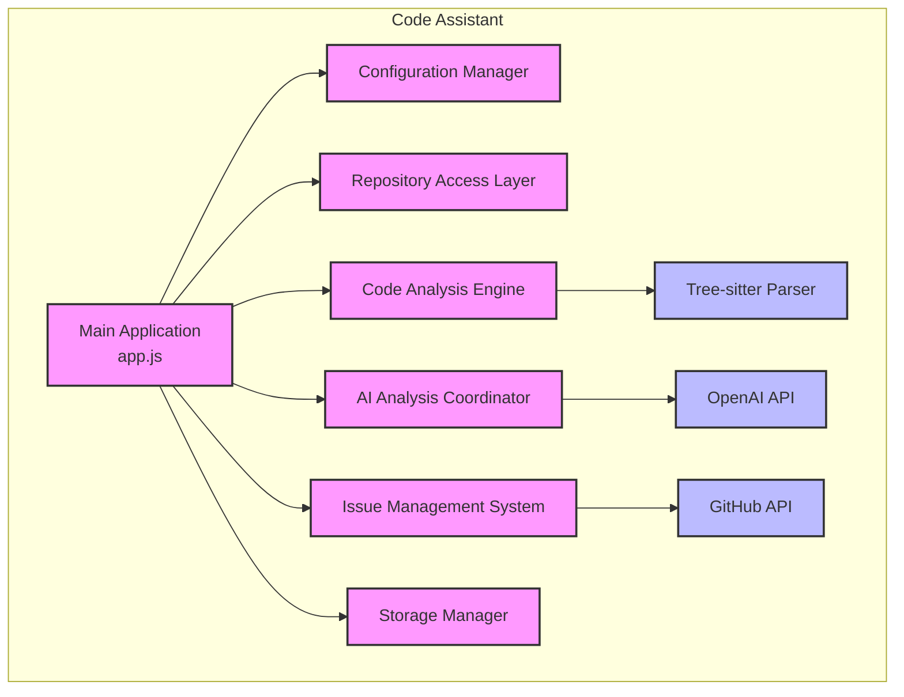

# Cline-Inspired Architecture Diagram

This document provides a visual representation of the proposed architecture for our Code Assistant, inspired by Cline's implementation.

## Current Architecture



## Proposed Architecture (Cline-Inspired)

```mermaid
graph TB
    subgraph "Code Assistant"
        subgraph "Core Extension"
            ExtensionEntry["Extension Entry<br/>app.js"]
            Controller["Controller<br/>core/controller/index.js"]
            Task["Task<br/>core/task/index.js"]
            GlobalState["Global State"]
            SecretsStorage["Secrets Storage"]
        end

        subgraph "Components"
            RepoAccess["Repository Access Layer"]
            CodeAnalysis["Code Analysis Engine"]
            AIAnalysis["AI Analysis Coordinator"]
            IssueManagement["Issue Management System"]
            VectorDB["Vector Database"]
        end

        subgraph "Storage"
            TaskStorage["Task Storage<br/>Per-Task Files & History"]
            Cache["Cache System"]
        end

        subgraph "API Providers"
            OpenAI["OpenAI API"]
            Anthropic["Anthropic API"]
            Bedrock["AWS Bedrock API"]
            OtherAPIs["Other API Providers"]
        end

        subgraph "Tools"
            TreeSitter["Tree-sitter Parser"]
            GitHub["GitHub API"]
            Git["Git Integration"]
            MemoryBank["Memory Bank"]
        end
        
        % Core Extension Flow
        ExtensionEntry --> Controller
        Controller --> Task
        Controller --> GlobalState
        Controller --> SecretsStorage
        Task --> TaskStorage
        
        % Component Integration
        Controller --> RepoAccess
        Controller --> CodeAnalysis
        Controller --> AIAnalysis
        Controller --> IssueManagement
        Controller --> VectorDB
        
        % API Integration
        AIAnalysis --> OpenAI
        AIAnalysis --> Anthropic
        AIAnalysis --> Bedrock
        AIAnalysis --> OtherAPIs
        
        % Tool Integration
        CodeAnalysis --> TreeSitter
        IssueManagement --> GitHub
        Task --> Git
        Task --> MemoryBank
        
        % Cache System
        AIAnalysis --> Cache
        CodeAnalysis --> Cache
        VectorDB --> Cache
    end
    
    classDef core fill:#f9f,stroke:#333,stroke-width:2px
    classDef components fill:#bfb,stroke:#333,stroke-width:2px
    classDef storage fill:#fdb,stroke:#333,stroke-width:2px
    classDef api fill:#bbf,stroke:#333,stroke-width:2px
    classDef tools fill:#ddd,stroke:#333,stroke-width:2px
    
    class ExtensionEntry,Controller,Task,GlobalState,SecretsStorage core
    class RepoAccess,CodeAnalysis,AIAnalysis,IssueManagement,VectorDB components
    class TaskStorage,Cache storage
    class OpenAI,Anthropic,Bedrock,OtherAPIs api
    class TreeSitter,GitHub,Git,MemoryBank tools
```

## Key Architectural Improvements

1. **Centralized Controller**:
   - Acts as the single source of truth for the application state
   - Coordinates all components and tasks
   - Manages state distribution and synchronization

2. **Task Management System**:
   - Handles the execution of AI requests and tool operations
   - Manages task history and state
   - Coordinates tool execution and approval workflows

3. **Multi-Provider Support**:
   - Supports multiple AI providers through a unified interface
   - Allows switching between providers based on configuration
   - Handles provider-specific authentication and API calls

4. **Vector Database Integration**:
   - Stores code embeddings for semantic search
   - Enables efficient retrieval of relevant code snippets
   - Improves context management and relevance

5. **Enhanced Storage System**:
   - Task-specific storage for history and state
   - Caching system for API responses and parsed code
   - Secure storage for sensitive information

6. **Tool Integration**:
   - Tree-sitter for code parsing and analysis
   - GitHub API for issue management
   - Git integration for commit message generation and diff analysis
   - Memory Bank for storing project context

## Component Interactions

### Controller Interactions

The Controller is the central component that:
- Initializes and coordinates all other components
- Manages application state and configuration
- Handles user interactions and commands
- Distributes state updates to components

### Task Execution Flow

1. User initiates a task (e.g., analyze repository)
2. Controller creates a Task instance
3. Task coordinates with components to execute the request:
   - Repository Access Layer clones and accesses files
   - Code Analysis Engine parses and analyzes code
   - Vector Database retrieves relevant code snippets
   - AI Analysis Coordinator sends requests to AI providers
   - Issue Management System creates issues from findings
4. Task updates its state and history
5. Controller updates the application state

### API Provider Selection

1. Controller loads API configuration from state
2. AI Analysis Coordinator selects the appropriate provider
3. Provider-specific handlers format requests and handle responses
4. Results are processed and returned to the Task

## Conclusion

This architecture provides a solid foundation for implementing the enhancements described in the [Cline-Inspired Enhancements](./cline-inspired-improvements.md) document. By adopting this architecture, we can create a more modular, maintainable, and powerful Code Assistant that leverages the best practices from Cline's implementation.
