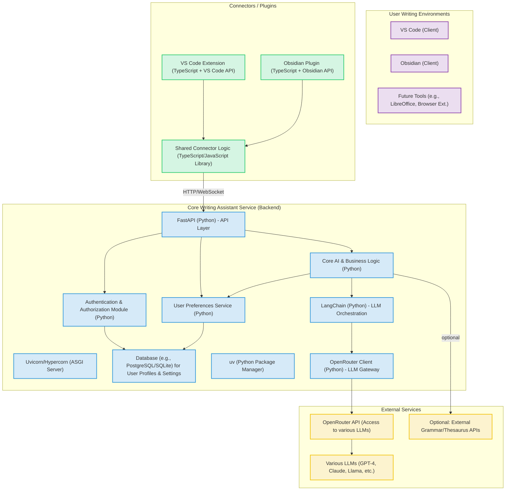
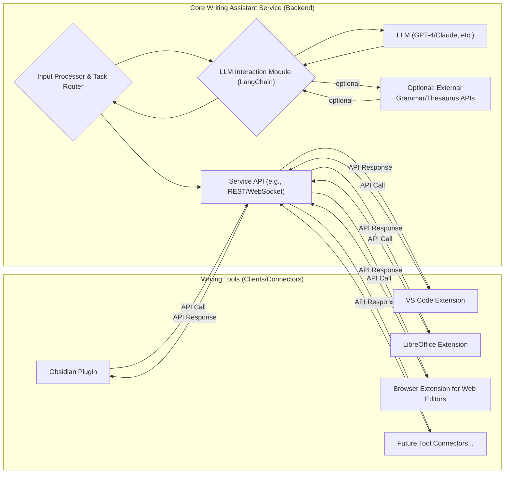

# Day 4: Writing Assistant - Architectural Plan

This document summarizes the architectural plan for the Day 4 Writing Assistant, focusing on an integration-first approach.

## 1. Initial Goal
- Create a Writing Assistant as per the initial specification in `agent-spec.md`.

## 2. Shift in Focus
- The project will prioritize **integrating with existing writing tools**, particularly open-source ones.
- The aim is to provide AI assistance directly within users' current workflows, rather than building a standalone application.

## 3. Architectural Approach: Layered System

A layered system is proposed:

-   **Core Writing Assistant Service (Backend):**
    -   A central service built with **Python/FastAPI**, utilizing `uv` as the package manager.
    -   Houses the core AI logic: LLM interaction via **LangChain** and **OpenRouter** (for LLM flexibility), prompt management, and task processing for grammar, summarization, tone adjustment, drafting, etc.
    -   Includes modules for **User Authentication & Authorization** and a **User Preferences Service** to manage user-specific settings (e.g., preferred LLM, custom prompts) stored in a **Database** (e.g., SQLite for MVP, PostgreSQL for production).
-   **Connectors/Plugins (Frontend/Clients):**
    -   Lightweight plugins or extensions for various target writing applications (e.g., Obsidian, VS Code – both developed using **TypeScript**).
    -   These connectors will leverage a **Shared Connector Logic Library (TypeScript/JavaScript)**. This library will handle common tasks like API communication with the Core Service, state management, and data model definitions, promoting code reuse.
    -   The platform-specific part of each connector will handle:
        -   UI integration within the host application (using native elements).
        -   Capturing user input/selected text via the host application's API.
        -   Calling the Shared Connector Logic library, which in turn calls the Core Service API.
        -   Displaying results back within the host application.

## 3.1. Detailed Tech Stack and Component Architecture

The following diagram and descriptions outline the chosen technologies for each component of the Writing Assistant:

### Key Technology Choices:

*   **Core Writing Assistant Service (Backend):**
    *   **Language/Framework:** Python with FastAPI.
    *   **Package Manager:** `uv`.
    *   **LLM Interaction:** LangChain (Python library) for orchestration, OpenRouter Client (Python) for flexible LLM access.
    *   **User Management:** Dedicated modules for Authentication/Authorization and User Preferences, backed by a Database (SQLite for MVP, PostgreSQL/MySQL for production).
    *   **API:** RESTful (initially).

*   **Connectors/Plugins:**
    *   **VS Code Extension:** TypeScript, VS Code Extension API.
    *   **Obsidian Plugin:** TypeScript, Obsidian Plugin API.
    *   **Shared Connector Logic Library:** TypeScript/JavaScript (npm package). Contains:
        *   `ApiService`: Backend communication.
        *   `StateManager` (Optional): Shared client-side state.
        *   `DataModel`: TypeScript interfaces for API payloads.
        *   `Utilities`: Common helper functions.

*   **External Services:**
    *   **OpenRouter:** Gateway to various LLMs.

### Logical Layered Architecture Diagram:

## 4. Development Phases

-   **Phase 1 (MVP):**
    -   **Goal 1:** Develop the Core Writing Assistant Service.
        -   Implement API endpoints for key tasks: `/draft`, `/analyze_grammar_style`, `/summarize`, `/adjust_tone`.
    -   **Goal 2:** Develop an initial Connector for one target platform (e.g., Obsidian or VS Code) as a proof-of-concept.
-   **Phase 2: Expand Connector Ecosystem:**
    -   Develop connectors for other prioritized open-source tools (e.g., the other of Obsidian/VS Code, LibreOffice Writer, Browser Extension, Joplin plugin).
-   **Phase 3: Feature Enhancement & Service Maturity:**
    -   Add advanced features to the Core Service (e.g., handling longer documents, user-specific style profiles).
    -   Refine the API and improve the user experience within each connector.

## 5. Unique Selling Proposition (USP)

-   **Seamless Workflow Integration:** "AI Where You Write," eliminating context switching.
-   **Centralized & Evolving Intelligence:** Core service updates benefit all connected tools instantly.
-   **Consistency Across Diverse Tools:** Familiar AI features across different applications.
-   **Extensibility & Open-Source Synergy:** Easier to add support for new tools and leverage communities.
-   **Potential for Deep Customization & Personalization** (Future): Tailored AI assistance.
-   **Focused Augmentation, Not Replacement:** Enhancing existing tools users know and love.