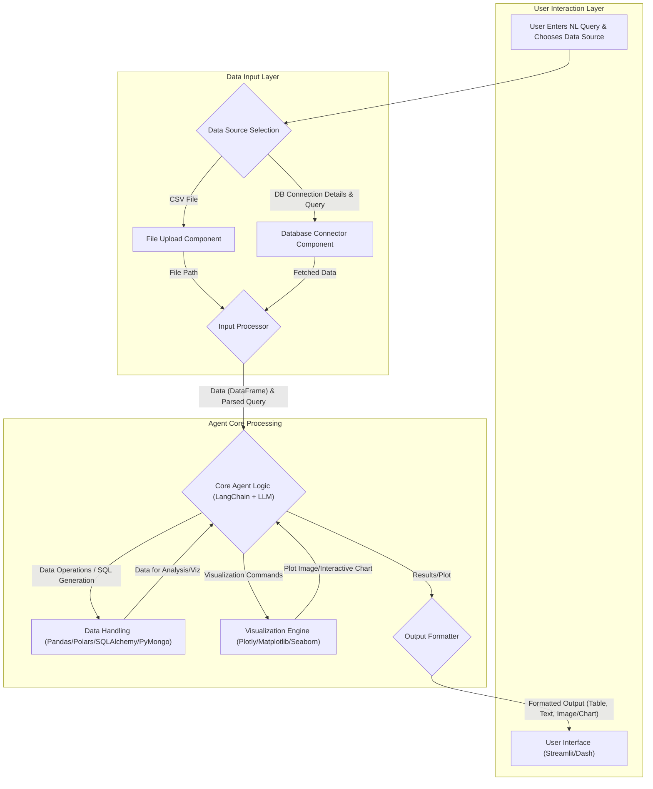

# Day 5: Data Analysis Agent - Architecture Plan

## 1. Project Goal
Develop a Data Analysis Agent capable of loading, analyzing, and visualizing data from various sources including CSV files, other structured file formats, and databases (e.g., PostgreSQL, MySQL, MongoDB), based on natural language queries, with potential for robust and unique features.

## 2. Core Components & Workflow

## 3. Detailed Initial Plan (Baseline from Spec, expanded for DB & File Loaders)

1.  **Environment Setup & Basic Structure:**
    *   Directory structure for `agents/Day-05-Data-Analysis-Agent/app`.
    *   `pyproject.toml` with initial dependencies (including DB drivers and loader-specific libraries as needed).
    *   Basic `.gitignore`, `.env.example`, `README.md`.
2.  **Input Processing Module:**
    *   **2.1. Data Source Selection:** UI element for user to choose File Upload or Database.
    *   **2.2. File Upload & Database Connector:**
        *   **File Upload:** UI for selecting local files.
        *   **Database Connector:** UI for inputting connection parameters (type, host, port, user, pass, db_name). Logic to establish connection. Mechanism for user to specify table/collection or an initial query.
    *   **2.3. Supported Data Formats & Loaders (LangChain Integrations):**
        *   The agent will aim to support a variety of structured data sources through LangChain document loaders. The initial focus will be on the most common formats, with others as stretch goals or future enhancements.
        *   **Core File Formats:**
            *   CSV: [`CSVLoader`](https://python.langchain.com/docs/integrations/document_loaders/csv)
            *   Microsoft Excel (.xls, .xlsx): [`UnstructuredExcelLoader`](https://python.langchain.com/docs/integrations/document_loaders/microsoft_excel) (via `unstructured` library)
            *   JSON: [`JSONLoader`](https://python.langchain.com/docs/integrations/document_loaders/json) (potentially with `jq_schema`)
            *   TSV: [`TSVLoader`](https://python.langchain.com/docs/integrations/document_loaders/tsv) (or generic text/CSV loader configured for tabs)
        *   **DataFrame Loaders:**
            *   Pandas DataFrame: [`PandasDataFrameLoader`](https://python.langchain.com/docs/integrations/document_loaders/pandas_dataframe)
            *   Polars DataFrame: [`PolarsDataFrameLoader`](https://python.langchain.com/docs/integrations/document_loaders/polars_dataframe)
        *   **Cloud/Hybrid Spreadsheet/Database Services:**
            *   Google Drive (for Google Sheets, if feasible for tabular data): [`GoogleDriveLoader`](https://python.langchain.com/docs/integrations/document_loaders/google_drive)
            *   Airtable: [`AirtableLoader`](https://python.langchain.com/docs/integrations/document_loaders/airtable)
        *   **Database Systems (via SQLAlchemy for SQL, specific drivers for NoSQL):**
            *   PostgreSQL, MySQL, SQLite (via SQLAlchemy)
            *   MongoDB (via PyMongo)
            *   *For a comprehensive list of potential database loaders, see Section 5.*
    *   **2.4. Data Loading:** Load data from the selected file or database query result into a Pandas/Polars DataFrame.
    *   **2.5. Natural Language Query Input.**
3.  **Core Agent Logic - LLM Integration:**
    *   LangChain Agent/Chain setup.
        *   For CSV/DataFrame/File-based data: Pandas DataFrame Agent or custom chain.
        *   For SQL DBs: LangChain SQLDatabaseChain or SQL Agent.
    *   LLM Prompting:
        *   For DataFrames: Generate Pandas/Polars code, Matplotlib/Plotly code, and interpret results.
        *   For SQL DBs: Generate SQL queries based on NL, then potentially Pandas/Plotly code on results.
        *   For NoSQL (MongoDB): Generate PyMongo code to fetch data, then treat as DataFrame.
    *   Secure code/query execution.
    *   Error handling for connections, queries, and code execution.
4.  **Data Handling & Analysis:**
    *   Driven by LLM-generated code/queries.
    *   Operations on DataFrames (inspection, stats, filtering, correlation).
    *   Direct SQL querying for SQL DBs.
5.  **Visualization Engine:** (Largely unchanged, operates on DataFrames)
    *   LLM generates code for various chart types.
    *   Capture static images or prepare interactive chart data.
6.  **Output Formatting Module:** (Largely unchanged)
    *   Display DataFrames, textual summaries, and visualizations.
7.  **User Interface:**
    *   Enhanced UI for data source selection, file upload, and DB connection input.
8.  **Testing & Refinement:**
    *   Test with various supported file types and connections to target database types.

## 4. Potential Unique Features (Brainstormed)
*   **Multi-Source Connectivity:** Seamlessly switch between and analyze data from various files (CSV, Excel, JSON, TSV) and databases (PostgreSQL, MySQL, MongoDB, etc.).
*   **Flexible LLM Access:** Utilize OpenRouter for a wide range of hosted models and support local LLMs for privacy/offline use.
*   **Proactive Insights & Anomaly Detection:** Agent suggests analyses or highlights anomalies.
*   **Conversational Refinement of Visualizations:** Users iteratively modify plots via natural language.
*   **Code Transparency & Export:** Display and allow export of generated code/SQL, data, and plots.
*   **Automated Data Cleaning Suggestions:** Agent identifies and suggests fixes for data quality issues.
*   **Interactive Visualizations:** Using libraries like Plotly for dynamic charts.
*   **Simplified Statistical Explanations:** LLM explains statistical results in plain language.

## 5. Proposed Robust Tech Stack (Broad Horizon)

*   **Core Language & Backend Framework:**
    *   **Python**
    *   **FastAPI** (Optional, for scalability/decoupling)
*   **LLM Orchestration & Agent Logic:**
    *   **LangChain** (including SQLDatabaseChain/Agent and various Document Loaders)
    *   **LLM Access Layer:**
        *   **OpenRouter:** For access to a wide variety of hosted LLMs (e.g., GPT models, Claude models, Llama models, etc.) via a unified API. (LangChain Integration: `OpenRouterChat`)
        *   **Local LLMs:** For privacy, offline use, and cost-effectiveness.
            *   Serving: Ollama, llama.cpp server, Hugging Face TGI, vLLM, etc.
            *   LangChain Integration: `OllamaChat`, `ChatMLflowAIGateway`, or custom wrappers for local endpoints.
    *   **LLM Choice (Examples):**
        *   Via OpenRouter: GPT-4/GPT-4o, Claude 3 Opus/Sonnet/Haiku, Llama 3, Mistral Large/Medium, etc.
        *   Local: Llama 3, Mistral, Phi-3, Gemma, etc. (depending on local hardware capabilities).
*   **Data Connectors, Loaders & Processing Engine:**
    *   **File Loaders (LangChain):**
        *   [`CSVLoader`](https://python.langchain.com/docs/integrations/document_loaders/csv)
        *   [`UnstructuredExcelLoader`](https://python.langchain.com/docs/integrations/document_loaders/microsoft_excel) (requires `unstructured`, `python-magic`, `openpyxl`, `xlrd`)
        *   [`JSONLoader`](https://python.langchain.com/docs/integrations/document_loaders/json) (optional `jq`)
        *   [`TSVLoader`](https://python.langchain.com/docs/integrations/document_loaders/tsv)
        *   [`PandasDataFrameLoader`](https://python.langchain.com/docs/integrations/document_loaders/pandas_dataframe)
        *   [`PolarsDataFrameLoader`](https://python.langchain.com/docs/integrations/document_loaders/polars_dataframe)
        *   [`GoogleDriveLoader`](https://python.langchain.com/docs/integrations/document_loaders/google_drive) (requires `google-api-python-client`, `google-auth-httplib2`, `google-auth-oauthlib`) - *Note: LangChain docs state "Google Docs only", feasibility for Sheets to be confirmed.*
        *   [`AirtableLoader`](https://python.langchain.com/docs/integrations/document_loaders/airtable) (requires `pyairtable`)
    *   **Database Connectivity & Loaders (LangChain & direct drivers):**
        *   SQLAlchemy (ORM for SQL DBs): `https://python.langchain.com/docs/integrations/tools/sql_database`
            *   PostgreSQL (driver: `psycopg2-binary`)
            *   MySQL (driver: `mysql-connector-python`)
            *   SQLite (built-in)
            *   Microsoft SQL Server (driver: `pyodbc`)
            *   Oracle (driver: `cx_Oracle`)
            *   *Many others supported by SQLAlchemy*
        *   MongoDB: [`MongoLoader`](https://python.langchain.com/docs/integrations/document_loaders/mongodb) (requires `pymongo`)
        *   DuckDB: [`DuckDBLoader`](https://python.langchain.com/docs/integrations/document_loaders/duckdb) (requires `duckdb_engine` for SQLAlchemy or `duckdb` direct)
        *   Google BigQuery: [`BigQueryLoader`](https://python.langchain.com/docs/integrations/document_loaders/google_bigquery) (requires `google-cloud-bigquery`)
        *   Snowflake: [`SnowflakeLoader`](https://python.langchain.com/docs/integrations/document_loaders/snowflake) (requires `snowflake-connector-python` or `snowflake-sqlalchemy`)
        *   *Selected other relevant database loaders from LangChain documentation (refer to links for specific dependencies):*
            *   Alibaba Cloud MaxCompute: [`MaxComputeLoader`](https://python.langchain.com/docs/integrations/document_loaders/alibaba_cloud_maxcompute)
            *   Amazon Athena: [`AthenaLoader`](https://python.langchain.com/docs/integrations/document_loaders/athena)
            *   AstraDB (Cassandra): [`AstraDBLoader`](https://python.langchain.com/docs/integrations/document_loaders/astradb)
            *   Cassandra (direct): [`CassandraLoader`](https://python.langchain.com/docs/integrations/document_loaders/cassandra)
            *   Couchbase: [`CouchbaseLoader`](https://python.langchain.com/docs/integrations/document_loaders/couchbase)
            *   Fauna: [`FaunaLoader`](https://python.langchain.com/docs/integrations/document_loaders/fauna)
            *   Google Cloud SQL variants (covered by SQLAlchemy drivers)
            *   Google Firestore: [`FirestoreLoader`](https://python.langchain.com/docs/integrations/document_loaders/google_firestore)
            *   Google Spanner: [`SpannerLoader`](https://python.langchain.com/docs/integrations/document_loaders/google_spanner)
            *   Kinetica: [`KineticaLoader`](https://python.langchain.com/docs/integrations/document_loaders/kinetica)
            *   Oracle Autonomous Database: [`OracleAutonomousDatabaseLoader`](https://python.langchain.com/docs/integrations/document_loaders/oracleadb_loader)
            *   Rockset: [`RocksetLoader`](https://python.langchain.com/docs/integrations/document_loaders/rockset)
            *   SingleStore: [`SingleStoreLoader`](https://python.langchain.com/docs/integrations/document_loaders/singlestore)
            *   SurrealDB: [`SurrealDBLoader`](https://python.langchain.com/docs/integrations/document_loaders/surrealdb)
            *   TiDB: [`TiDBLoader`](https://python.langchain.com/docs/integrations/document_loaders/tidb)
    *   **Core Data Processing Libraries:**
        *   **Pandas** (Baseline for DataFrame operations)
        *   **Polars** (For performance with larger datasets)
        *   **NumPy & SciPy** (Advanced statistics)
*   **Visualization Engine:**
    *   **Plotly & Plotly Express** (Primary for interactivity)
    *   **Matplotlib & Seaborn** (For static plots or specific needs)
*   **Frontend/User Interface:**
    *   **Streamlit** (Rapid development for data apps)
    *   **Dash by Plotly** (More complex interactive dashboards)
*   **Database (Optional - Persistence/Caching for Agent itself):**
    *   **SQLite** (Simple local storage)

## 6. Focused Tech Stack for Day 5 Implementation

To balance ambition with the 30-day challenge timeline, the core focus for Day 5 will be:

*   **Primary Data Source Goals for Day 5:**
    *   Robust **CSV file** analysis capabilities.
    *   Integration with at least **one SQL Database type** (e.g., SQLite for ease of setup, or PostgreSQL if a local instance is available) using LangChain's SQL tools (e.g., `SQLDatabaseChain` or SQL Agent).
*   **LLM Orchestration:** LangChain.
*   **LLM Access & Choice:**
    *   **Primary:** Utilize **OpenRouter** via LangChain integration (`OpenRouterChat`) to access a suitable hosted model (e.g., Claude 3 Haiku, Llama 3 8B, or a free-tier model for initial development).
    *   **Secondary/Stretch Goal:** Implement support for at least one **Local LLM** via Ollama (`OllamaChat` in LangChain) if time permits, allowing for offline/private use.
*   **Data Processing:**
    *   For CSV: Pandas (leveraging `read_csv`).
    *   For SQL Databases: SQLAlchemy (as used by LangChain's SQL tools).
*   **Visualization:** Start with Matplotlib/Seaborn for outputs from both CSV and SQL query results. Aim for one Plotly chart if time permits.
*   **Frontend:** Streamlit.
*   **Core Language:** Python.
*   **Further Stretch Goals for Day 5 / Subsequent Iterations:**
    *   Support for Microsoft Excel files.
    *   Broader file format support (JSON, TSV).
    *   Support for other SQL database types or NoSQL databases (e.g., MongoDB).
    *   More advanced interactive visualizations with Plotly.
    *   UI elements to select between OpenRouter models or local LLMs.

This revised focus ensures that core connectivity to both flat files (CSV) and relational databases (SQL) is achieved on Day 5, with flexible LLM access.