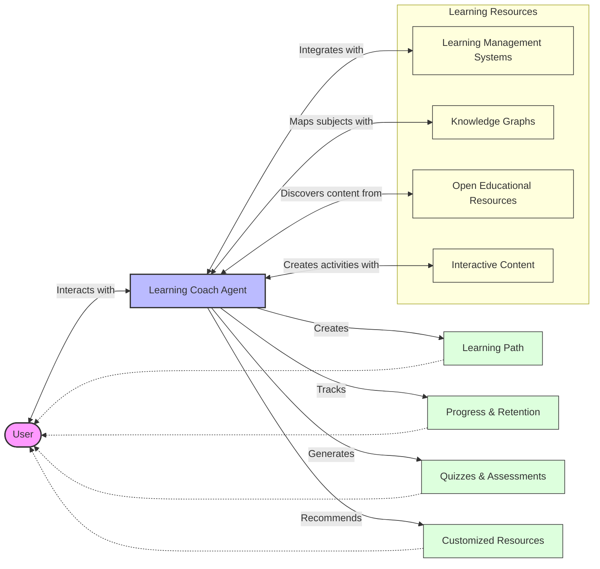
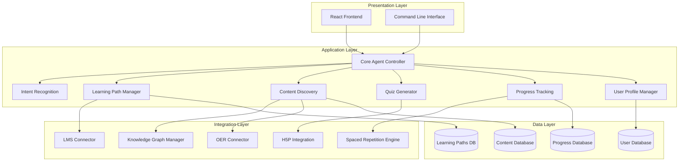
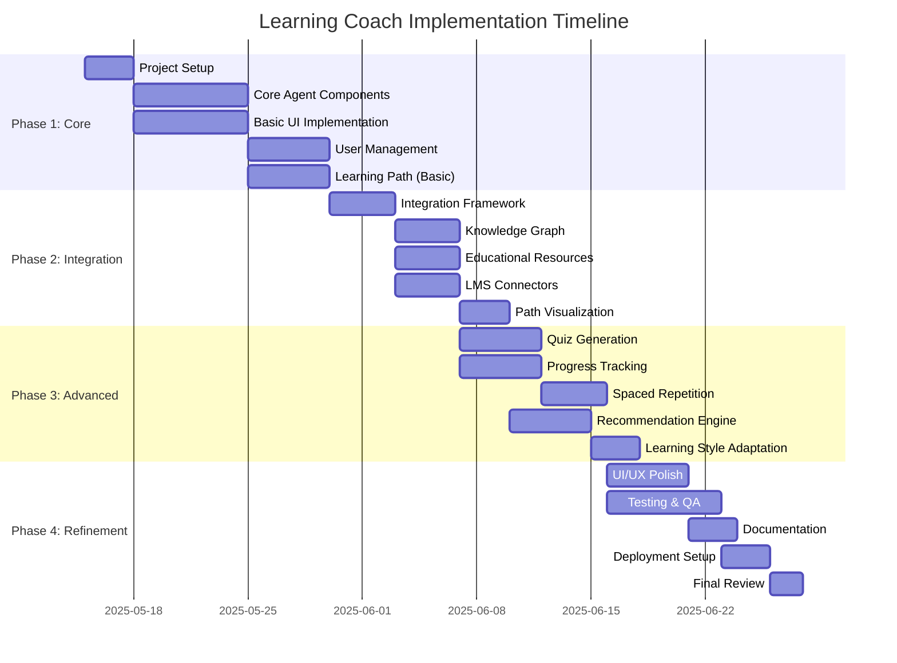
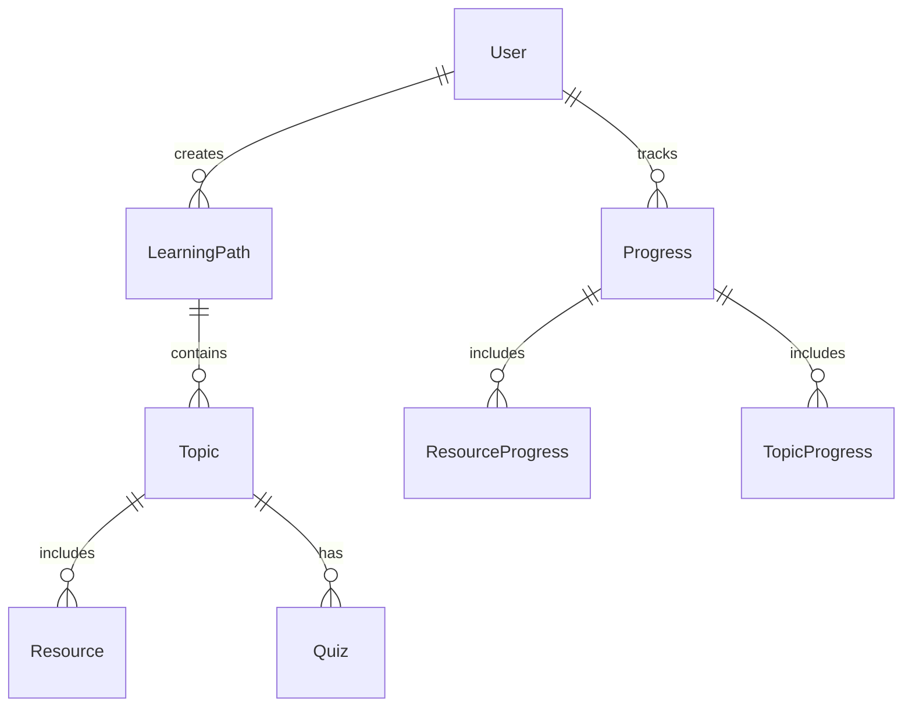

# Learning Coach Agent

An AI-powered learning assistant that creates personalized learning paths, tracks progress, generates quizzes, and discovers relevant educational resources across both academic subjects and professional skills.

## Project Overview

The Learning Coach is a comprehensive learning agent that adapts to your learning style and provides a customized experience to enhance your learning journey. It integrates with multiple open-source learning tools to provide a rich, adaptable learning experience.



### Key Features

- **Personalized Learning Paths**: Get customized learning plans based on your goals and existing knowledge
- **Progress Tracking**: Monitor your advancement with visual progress tracking and spaced repetition
- **Resource Discovery**: Find high-quality educational content from trusted open sources
- **Interactive Assessments**: Test your knowledge with adaptive quizzes and get immediate feedback
- **Learning Style Adaptation**: Content delivery adapted to your preferred learning style

## Documentation

### Core Documentation

- [**Agent Specification**](agent-spec.md) - Original agent requirements and specifications
- [**User Guide**](docs/user_guide.md) - Guide for end-users with usage instructions and examples
- [**Implementation Plan**](docs/implementation-plan.md) - Detailed plan for implementing the agent
- [**Task Tracker**](docs/task-tracker.md) - Breakdown of implementation tasks and their status

### Technical Documentation

- [**Architecture**](docs/architecture.md) - Technical architecture and component descriptions
- [**Technical Specifications**](docs/technical_specifications.md) - Detailed specifications including database schema, API endpoints, and deployment
- [**Integration Guide**](docs/integrations.md) - Guide for integrating with various open-source learning tools

## Architecture

The Learning Coach agent follows a modular, service-oriented architecture:



## Technology Stack

### Backend
- **Language**: Python 3.9+
- **Framework**: FastAPI
- **Agent Frameworks**: 
  - LangChain for foundational components
  - LangGraph for building stateful, multi-actor workflows
- **Dependency Management**: uv
- **Database**: PostgreSQL

### Frontend
- **Framework**: React with Vite
- **State Management**: Context API and hooks
- **Routing**: React Router
- **Visualization**: Mermaid.js, Recharts

### Integrations
- **LMS**: Frappe LMS, CourseList
- **Knowledge Graphs**: Wikidata, ConceptNet
- **Educational Resources**: OER Commons, OpenStax
- **Assessment Tools**: H5P, SM-2 Algorithm

## Implementation Timeline



The implementation is broken down into four phases:

1. **Phase 1**: Core agent and basic functionality (Week 1)
2. **Phase 2**: Integration layer with external learning tools (Week 2)
3. **Phase 3**: Advanced features like quiz generation and progress tracking (Week 3)
4. **Phase 4**: UI refinement and comprehensive testing (Week 4)

Refer to the [Task Tracker](docs/task-tracker.md) for detailed tasks in each phase.

## Getting Started

### Prerequisites
- Python 3.9+
- Node.js 16+
- PostgreSQL 14+

### Installation

1. Clone the repository:
   ```bash
   git clone <repository-url>
   cd agents/Day-06-Learning-Coach
   ```

2. Set up the backend:
   ```bash
   cd app
   
   # Create and activate virtual environment using uv
   uv venv
   source .venv/bin/activate  # On Windows: .venv\Scripts\activate
   
   # Install dependencies
   uv pip install -e .
   
   # Set up environment variables
   cp .env.example .env
   # Edit .env with your API keys and configuration
   ```

3. Set up the frontend:
   ```bash
   cd ../frontend
   
   # Install dependencies
   npm install
   
   # Create environment file
   cp .env.example .env
   # Edit .env with backend API URL and other configuration
   ```

4. Start the backend server:
   ```bash
   cd ../app
   python main.py
   ```

5. Start the frontend development server:
   ```bash
   cd ../frontend
   npm run dev
   ```

6. Access the application at http://localhost:5173

### Quick Start for Development

For detailed development instructions, refer to the [Implementation Plan](docs/implementation-plan.md) document.

## Database Schema Overview

The database includes tables for users, learning paths, topics, resources, quizzes, and progress tracking. For the complete schema, see the [Technical Specifications](docs/technical_specifications.md) document.



## API Overview

The API follows RESTful principles with the following main endpoints:

- `/api/auth/*` - Authentication endpoints
- `/api/users/*` - User management endpoints
- `/api/paths/*` - Learning path endpoints
- `/api/topics/*` - Topic and resource endpoints
- `/api/quizzes/*` - Quiz endpoints
- `/api/progress/*` - Progress tracking endpoints
- `/api/spaced-repetition/*` - Spaced repetition endpoints
- `/api/discover/*` - Content discovery endpoints

For complete API documentation, see the [Technical Specifications](docs/technical_specifications.md) document.

## Integration Guide

The Learning Coach integrates with various open-source learning tools:

- **Learning Management Systems**: Frappe LMS, CourseList
- **Learning Pathways**: Mangro.io, Learning-Pathways.org
- **Knowledge Graphs**: Wikidata, ConceptNet
- **Educational Resources**: OER Commons, OpenStax
- **Assessment Tools**: H5P, SM-2 Algorithm

For detailed integration instructions, see the [Integration Guide](docs/integrations.md).

## Deployment

The application supports deployment to multiple environments (development, staging, production) with a comprehensive CI/CD pipeline. For deployment instructions, see the [Technical Specifications](docs/technical_specifications.md) document.

## Contributing

1. Fork the repository
2. Create your feature branch: `git checkout -b feature/my-new-feature`
3. Commit your changes: `git commit -am 'Add some feature'`
4. Push to the branch: `git push origin feature/my-new-feature`
5. Submit a pull request

## License

This project is licensed under the MIT License - see the LICENSE file for details.

## Acknowledgements

- All the open-source learning tools and platforms integrated with this project
- The contributors to LangChain, LangGraph, and other frameworks used
- Everyone involved in creating and maintaining open educational resources