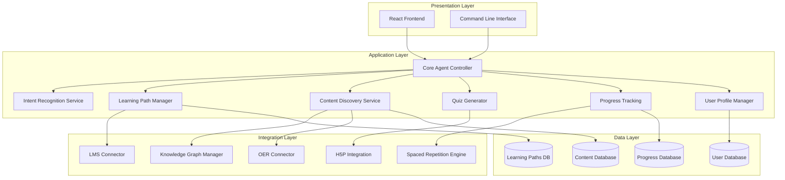
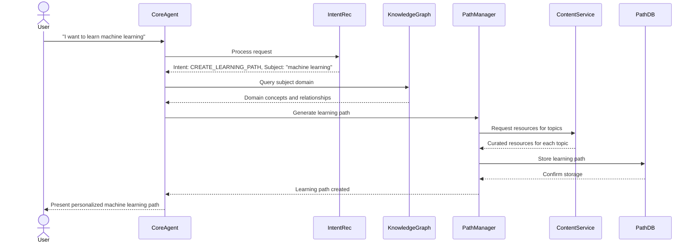
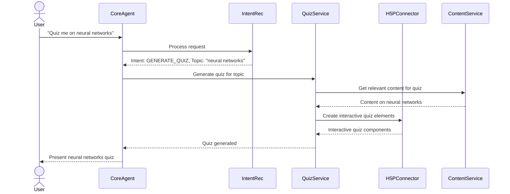
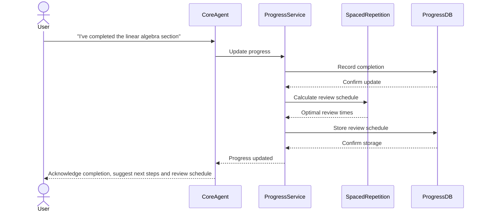
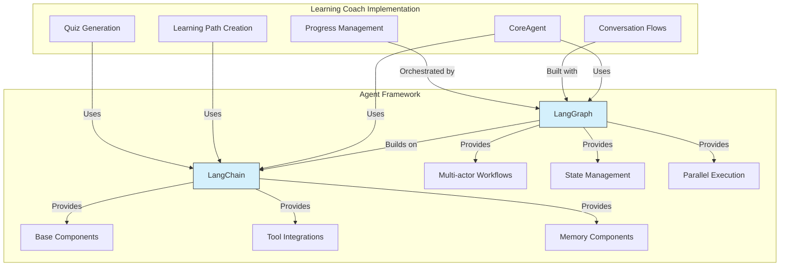

# Day 6: Learning Coach Agent - Architecture

## System Architecture Overview

The Learning Coach agent follows a modular, service-oriented architecture to provide flexibility, scalability, and ease of integration with various open-source learning tools. This document details the architectural design and component interactions.

## High-Level Architecture

## Component Details

### Presentation Layer

#### React Frontend
- **Purpose**: Provides graphical user interface for interacting with the agent
- **Features**:
  - Dashboard for user progress overview
  - Learning path visualization and navigation
  - Content viewing interface
  - Quiz taking interface
  - Settings and preferences management
- **Technologies**:
  - React with Vite for fast development
  - React Router for navigation
  - Context API and hooks for state management
  - Mermaid.js for path visualization
  - CSS modules for styling

#### Command Line Interface
- **Purpose**: Provides text-based interface for quick interactions
- **Features**:
  - Quick learning path status
  - Resource access
  - Quiz generation
  - Progress checking

### Application Layer

#### Core Agent Controller
- **Purpose**: Orchestrates interactions between components
- **Responsibilities**:
  - Routes user requests to appropriate services
  - Manages conversation context
  - Coordinates multi-step processes
  - Handles error conditions
- **Implementation**:
  - Built with LangChain for core functionality
  - Uses LangGraph for stateful, multi-actor workflows
  - Manages conversation state and context

#### Intent Recognition Service
- **Purpose**: Identifies user intent from natural language input
- **Responsibilities**:
  - Classifies requests (path creation, content access, quiz, etc.)
  - Extracts key parameters from requests
  - Manages context for multi-turn conversations

#### Learning Path Manager
- **Purpose**: Creates and manages personalized learning paths
- **Responsibilities**:
  - Path generation based on user goals and knowledge
  - Topic sequencing with prerequisites
  - Path adjustment based on progress and performance
  - Integration with LMS systems

#### Content Discovery Service
- **Purpose**: Finds and recommends learning resources
- **Responsibilities**:
  - Resource search across integrated repositories
  - Quality assessment of resources
  - Personalized recommendations
  - Content categorization and indexing

#### Quiz Generator
- **Purpose**: Creates assessments to test knowledge
- **Responsibilities**:
  - Quiz question generation
  - Answer evaluation
  - Performance analysis
  - Adaptive difficulty based on user proficiency

#### Progress Tracking Service
- **Purpose**: Monitors and manages user learning progress
- **Responsibilities**:
  - Tracking completed resources
  - Recording quiz results
  - Implementing spaced repetition schedules
  - Generating progress reports and visualizations

#### User Profile Manager
- **Purpose**: Manages user data and preferences
- **Responsibilities**:
  - Profile creation and updates
  - Learning style assessment
  - Interest and goal tracking
  - Privacy and data security

### Integration Layer

#### LMS Connector
- **Purpose**: Integrates with Learning Management Systems
- **Integrations**:
  - Frappe LMS
  - CourseList
  - Potential for other LMS systems

#### Knowledge Graph Manager
- **Purpose**: Manages concept relationships and subject mapping
- **Integrations**:
  - Wikidata
  - ConceptNet
  - Custom knowledge graphs

#### OER Connector
- **Purpose**: Accesses Open Educational Resources
- **Integrations**:
  - OER Commons
  - OpenStax
  - Project Gutenberg
  - Other open content repositories

#### H5P Integration
- **Purpose**: Leverages H5P for interactive content
- **Features**:
  - Quiz creation
  - Interactive content embedding
  - Activity tracking

#### Spaced Repetition Engine
- **Purpose**: Implements spaced repetition for optimal learning
- **Features**:
  - SM-2 algorithm implementation
  - Review scheduling
  - Memory retention optimization

### Data Layer

#### User Database
- **Purpose**: Stores user profiles and preferences
- **Schema Elements**:
  - User demographics and contact info
  - Learning preferences and styles
  - Goals and interests
  - Authentication data

#### Content Database
- **Purpose**: Indexes learning resources
- **Schema Elements**:
  - Resource metadata
  - Quality ratings
  - Tags and categorization
  - Usage statistics

#### Progress Database
- **Purpose**: Tracks user learning progress
- **Schema Elements**:
  - Completed resources
  - Quiz results
  - Spaced repetition schedules
  - Activity timestamps

#### Learning Paths Database
- **Purpose**: Stores learning path definitions
- **Schema Elements**:
  - Path structure and metadata
  - Topic sequences
  - Resource associations
  - Prerequisites

## Data Flow Diagrams

### Learning Path Creation Flow

### Quiz Generation Flow

### Progress Tracking Flow

## LangChain and LangGraph Integration

The Learning Coach agent leverages both LangChain and LangGraph in its implementation:

- **LangChain** provides the foundational components for:
  - Interacting with language models
  - Connecting to external tools and data sources
  - Creating chains of operations
  - Managing short-term memory and context

- **LangGraph** extends LangChain to provide:
  - Stateful multi-actor workflows
  - Graph-based execution flow
  - Sophisticated state management
  - Parallel processing capabilities
  - Persistent conversation state

By combining these frameworks, the Learning Coach can create complex, stateful interactions that persist across user sessions, coordinate between different components, and handle multi-step educational processes.

## Technology Stack Details

### Backend Technologies
- **Language**: Python 3.9+
- **Framework**: FastAPI for API endpoints
- **Agent Framework**: LangChain for components, LangGraph for workflows
- **Dependency Management**: uv for Python package management
- **Database**: SQLite (development), PostgreSQL (production)
- **Knowledge Graph**: RDFLib for Wikidata/ConceptNet integration
- **Authentication**: OAuth2 with JWT

### Frontend Technologies
- **Framework**: React with Vite
- **State Management**: Context API and hooks
- **Routing**: React Router
- **Visualization**: Mermaid.js for learning paths, Recharts for analytics
- **UI Library**: Optional use of Material-UI or Tailwind CSS
- **API Client**: Axios for API requests

### DevOps & Infrastructure
- **Containerization**: Docker
- **Testing**: Pytest for backend, React Testing Library for frontend
- **CI/CD**: GitHub Actions
- **Documentation**: MkDocs for documentation generation

## Security Considerations

1. **User Data Protection**:
   - Encryption for sensitive user data
   - Access control for user profiles
   - Compliance with privacy regulations

2. **API Security**:
   - Authentication for all API endpoints
   - Rate limiting to prevent abuse
   - Input validation to prevent injection attacks

3. **Third-Party Integration Security**:
   - Secure credential storage
   - Scope-limited authorization
   - Regular security audits of integrations

## Scalability Considerations

1. **Horizontal Scaling**:
   - Stateless service design for easy replication
   - Load balancing for user traffic distribution
   - Caching for frequent queries

2. **Performance Optimization**:
   - Efficient database queries and indexing
   - Asynchronous processing for time-intensive operations
   - Background workers for resource-intensive tasks

3. **Resource Management**:
   - Connection pooling for database efficiency
   - Throttling for external API calls
   - Resource quotas for equitable service distribution

## Monitoring and Logging

1. **System Monitoring**:
   - Service health checks
   - Performance metrics tracking
   - Resource utilization monitoring

2. **User Activity Logging**:
   - Learning activity logs
   - Error tracking
   - Usage patterns analysis

3. **Analytics Integration**:
   - Learning progress analytics
   - Resource effectiveness metrics
   - System usage patterns

## Conclusion

This architecture provides a comprehensive framework for implementing the Learning Coach agent with a focus on modularity, scalability, and integration with open-source learning tools. The service-oriented design allows for independent development and testing of components while maintaining a cohesive system through well-defined interfaces. The combination of LangChain and LangGraph enables sophisticated, stateful educational workflows that can adapt to user needs and learning styles.