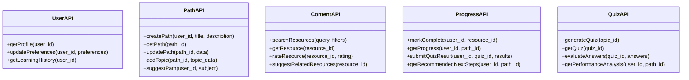

# Day 6: Learning Coach Agent - Implementation Plan

## Overview

This document outlines the detailed implementation plan for the Learning Coach agent. The agent will help users create personalized learning paths, track progress, generate quizzes, and discover relevant educational resources across both academic subjects and professional skills.

## System Architecture

The Learning Coach agent will be built with a modular architecture that integrates multiple open-source learning tools and frameworks.


### Component Description

1. **Core Agent** - The central orchestration layer built with LangChain and LangGraph that handles user requests, coordinates between components, and manages the overall learning experience.

2. **Intent Recognition** - Parses user input to determine what the user is trying to accomplish (create a learning path, get an explanation, take a quiz, etc.).

3. **Learning Path Manager** - Creates and manages personalized learning paths, incorporating concepts from Learning Pathways and Mangro.io.

4. **Content Discovery** - Searches for and recommends learning resources from OER Commons, OpenStax, and other sources.

5. **Progress Tracker** - Monitors user progress through learning paths, implementing spaced repetition algorithms (SM-2) for optimal retention.

6. **Quiz Generator** - Creates quizzes and assessments to test knowledge, potentially integrating with H5P.

7. **User Memory** - Maintains user profiles, preferences, and learning history.

## Open-Source Tool Integrations

### Learning Management Systems
- **Frappe LMS** - Open-source LMS for structured course content and organization
  - Integration Type: API
  - Use Case: Course structure and sequencing

- **CourseList** - For course content organization and digital downloads
  - Integration Type: API
  - Use Case: Content delivery and organization

### Learning Pathways Tools
- **Mangro.io Concepts** - For visual learning path creation
  - Integration Type: Concept adaptation
  - Use Case: Visual representation of learning paths

- **Learning-Pathways.org Models** - For organizing related learning resources
  - Integration Type: Concept adaptation
  - Use Case: Resource collection and curation

### Knowledge Graphs & Educational Resources
- **Wikidata/ConceptNet** - For mapping relationships between subjects
  - Integration Type: API/Database
  - Use Case: Subject relationship modeling, prerequisite identification

- **OER Commons** - Open Educational Resources repository
  - Integration Type: API/Web scraping
  - Use Case: Quality educational content access

- **OpenStax** - Free, peer-reviewed textbooks
  - Integration Type: API/Web scraping
  - Use Case: Core educational content

### Assessment Tools
- **H5P** - Open-source tool for creating interactive content and assessments
  - Integration Type: JavaScript library integration
  - Use Case: Interactive quizzes and content

- **SM-2 Algorithm** - Spaced repetition algorithm
  - Integration Type: Direct implementation
  - Use Case: Optimizing review intervals for better retention

## User Experience Flow


## Data Models

Key data models for the Learning Coach agent:

```python
class User:
    id: str
    name: str
    preferences: Dict[str, Any]
    learning_styles: List[str]
    interests: List[str]
    
class LearningPath:
    id: str
    title: str
    description: str
    topics: List[Topic]
    user_id: str
    created_at: datetime
    
class Topic:
    id: str
    title: str
    description: str
    resources: List[Resource]
    quizzes: List[Quiz]
    prerequisites: List[str]  # Topic IDs
    
class Resource:
    id: str
    title: str
    description: str
    type: str  # article, video, course, etc.
    url: str
    source: str
    estimated_time: int  # minutes
    
class Progress:
    user_id: str
    path_id: str
    completed_resources: List[str]  # Resource IDs
    quiz_results: Dict[str, float]  # Quiz ID to score
    last_activity: datetime
```

## API Design



## Implementation Phases

### Phase 1: Core Agent & Basic Functionality (Week 1)
- Set up project structure
- Implement core agent with LangChain and LangGraph
- Create basic React UI components
- Implement user profiles and preferences
- Develop basic learning path creation functionality

### Phase 2: Integration Layer (Week 2)
- Build API connectors for external services
- Implement Knowledge Graph integration (Wikidata/ConceptNet)
- Add OER Commons and OpenStax content access
- Create modular plugin system for integrations
- Implement initial learning path visualization

### Phase 3: Advanced Features (Week 3)
- Implement quiz generation with H5P
- Add progress tracking and visualization
- Develop spaced repetition system using SM-2 algorithm
- Create content recommendation engine
- Implement learning style adaptation

### Phase 4: UI Refinement & Testing (Week 4)
- Polish React UI/UX
- Develop visualization components for learning paths and progress
- Comprehensive testing of all components
- User feedback implementation
- Documentation and code cleanup

## Implementation Details

### File Structure

```
/agents/Day-06-Learning-Coach/
├── agent-spec.md
├── app/
│   ├── __init__.py
│   ├── main.py
│   ├── config.py
│   ├── cli.py
│   ├── agent.py
│   ├── pyproject.toml
│   ├── README.md
│   ├── core/
│   │   ├── __init__.py
│   │   ├── learning_path_manager.py
│   │   ├── content_discovery.py
│   │   ├── progress_tracker.py
│   │   ├── quiz_generator.py
│   │   └── user_memory.py
│   ├── integrations/
│   │   ├── __init__.py
│   │   ├── lms_connector.py
│   │   ├── knowledge_graph.py
│   │   ├── oer_connector.py
│   │   ├── h5p_connector.py
│   │   └── spaced_repetition.py
│   ├── models/
│   │   ├── __init__.py
│   │   ├── user.py
│   │   ├── learning_path.py
│   │   ├── content.py
│   │   └── progress.py
│   ├── api/
│   │   ├── __init__.py
│   │   ├── routes.py
│   │   └── controllers/
│   └── utils/
│       ├── __init__.py
│       ├── data_helpers.py
│       └── visualization.py
├── frontend/
│   ├── public/
│   │   ├── index.html
│   │   ├── favicon.ico
│   │   └── assets/
│   ├── src/
│   │   ├── App.jsx
│   │   ├── index.jsx
│   │   ├── components/
│   │   │   ├── Dashboard/
│   │   │   ├── LearningPath/
│   │   │   ├── ContentViewer/
│   │   │   ├── Quiz/
│   │   │   └── Progress/
│   │   ├── hooks/
│   │   ├── context/
│   │   ├── services/
│   │   └── utils/
│   ├── package.json
│   ├── vite.config.js
│   └── README.md
└── docs/
    ├── architecture.md
    ├── integrations.md
    ├── user_guide.md
    └── task-tracker.md
```

### Dependencies

- **Core**: Python 3.9+, LangChain for core components, LangGraph for workflows
- **Dependency Management**: uv for Python dependencies
- **UI**: React with Vite
- **Database**: SQLite for development, PostgreSQL for production
- **Knowledge Graphs**: RDFLib for working with Wikidata/ConceptNet
- **APIs**: FastAPI for building the agent's API layer
- **Testing**: Pytest for unit and integration testing

### Key Implementation Considerations

1. **Modularity**: The system should be designed with a plugin architecture to allow easy addition or replacement of components.

2. **Integration Standards**: Define clear interfaces for integrating with external tools and services.

3. **User Data Privacy**: Ensure user data is properly protected and consider implementing encryption for sensitive information.

4. **Performance**: Consider optimization techniques for handling large knowledge graphs and content repositories.

5. **Offline Mode**: Consider implementing capability for offline learning when connectivity is limited.

## Potential Challenges & Solutions

1. **Challenge**: Integration with diverse external tools
   **Solution**: Build a flexible plugin system with standardized interfaces

2. **Challenge**: Generating high-quality quizzes
   **Solution**: Combine LLM capabilities with templates and H5P integration

3. **Challenge**: Tracking progress across multiple learning paths
   **Solution**: Design a comprehensive progress tracking database model

4. **Challenge**: Resource quality assessment
   **Solution**: Implement user feedback mechanisms and content rating

5. **Challenge**: Personalization accuracy
   **Solution**: Continuous learning from user interactions and explicit preferences

## Testing Strategy

1. **Unit Testing**: Test individual components in isolation
2. **Integration Testing**: Test interactions between components
3. **End-to-End Testing**: Test complete user workflows
4. **User Acceptance Testing**: Gather feedback from actual users

## Future Extensions

1. Collaborative learning features
2. Integration with video conferencing for tutoring
3. Certification generation for completed paths
4. Community-contributed learning paths
5. Learning style assessment and adaptation

## Conclusion

This implementation plan provides a comprehensive roadmap for developing the Learning Coach agent with integration of multiple open-source learning tools. The modular architecture allows for flexibility and extensibility, while the phased implementation approach ensures that core functionality is delivered early with incremental improvements over time.