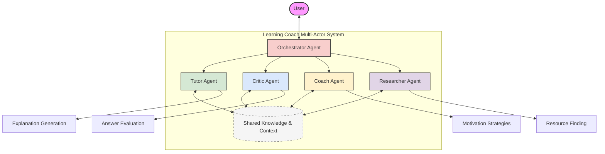
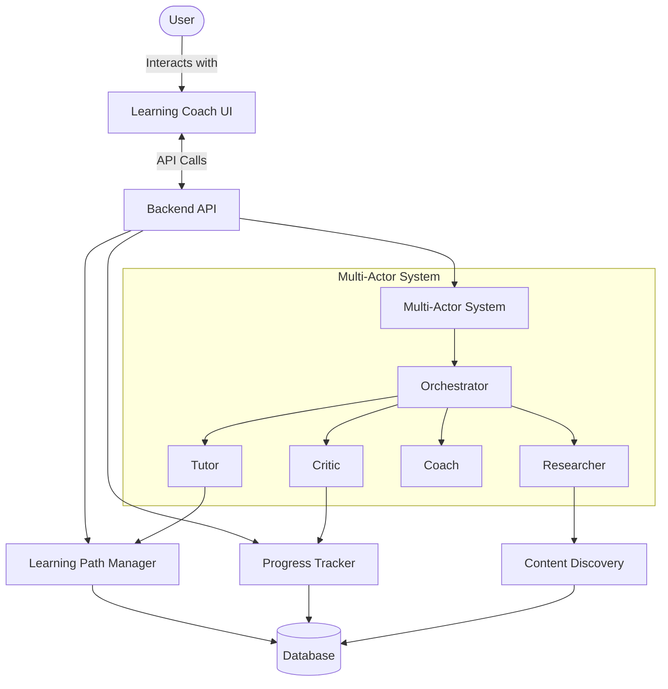

# Multi-Actor Learning System Architecture

This document elaborates on the multi-actor system that will be implemented in Phase 3 of the Learning Coach project. The system leverages LangGraph's capabilities for creating stateful, interacting agents that work together to provide a comprehensive learning experience.

## System Overview

## Agent Roles and Responsibilities

### Orchestrator Agent
The central coordinator that manages conversation flow and delegates tasks to specialized agents.

**Responsibilities:**
- Analyze user input to determine which specialized agent should respond
- Maintain overall conversation context and learning session state
- Manage transitions between different learning activities
- Synthesize responses from multiple agents when needed
- Handle error conditions and recovery

### Tutor Agent
Focuses on explaining concepts and teaching material in an effective way.

**Responsibilities:**
- Explain complex concepts with clarity and precision
- Adapt explanations to user's learning style and prior knowledge
- Provide examples, analogies, and visualizations
- Break down complex topics into manageable chunks
- Respond to conceptual questions in depth
- Generate practice exercises

### Critic Agent
Evaluates user responses and provides constructive feedback.

**Responsibilities:**
- Assess user answers to questions and exercises
- Identify misconceptions and knowledge gaps
- Provide targeted, constructive feedback
- Track common error patterns
- Adjust difficulty based on performance
- Validate learning path progress

### Coach Agent
Focuses on motivation, encouragement, and learning strategy.

**Responsibilities:**
- Provide encouragement and motivational support
- Suggest effective learning strategies
- Help user overcome learning obstacles
- Celebrate achievements and milestones
- Recommend optimal study schedules
- Provide productivity tips

### Researcher Agent
Finds and evaluates learning resources.

**Responsibilities:**
- Search for relevant learning materials
- Evaluate resource quality and relevance
- Summarize key points from resources
- Compare different resources on the same topic
- Find examples and case studies
- Identify prerequisite knowledge

## Detailed Implementation Tasks

### Design Multi-Actor Architecture

**Task Description:** Create the overall system design for the multi-agent learning coach, including agent interactions, state management, and conversation flow.

**Subtasks:**
1. Design agent interaction protocol
2. Define shared memory structure for inter-agent communication
3. Create conversation flow state machine
4. Design agent selection and handoff mechanisms
5. Create mechanisms for conflict resolution when agents disagree
6. Design debug/tracing capabilities for multi-agent interactions

**Implementation Considerations:**
- Use LangGraph's multi-agent graph capabilities to create the network of agents
- Design shared state that preserves context across agent transitions
- Create clear boundaries for agent responsibilities

### Implement Tutor Agent

**Task Description:** Develop the specialized agent focused on explaining concepts and teaching material.

**Subtasks:**
1. Create tutor agent node in LangGraph system
2. Implement explanation generation with adaptable complexity levels
3. Develop example and analogy generation capabilities
4. Create visualization suggestion functionality
5. Implement concept breakdown for complex topics
6. Develop knowledge assessment to gauge user understanding
7. Create exercise generation aligned with learning objectives

**Implementation Considerations:**
- Use few-shot examples for different explanation styles
- Implement mechanism to track explanation history to avoid repetition
- Create templates for common explanation patterns

### Implement Critic Agent

**Task Description:** Develop the specialized agent focused on evaluating user responses and providing feedback.

**Subtasks:**
1. Create critic agent node in LangGraph system
2. Implement answer evaluation logic with rubrics
3. Develop misconception detection and correction
4. Create feedback generation with varying levels of detail
5. Implement error pattern recognition across sessions
6. Develop adaptive difficulty adjustment based on performance
7. Create progress validation against learning objectives

**Implementation Considerations:**
- Create structured formats for assessment to ensure consistency
- Develop calibrated scoring mechanisms
- Implement context-aware feedback that references previous interactions

### Implement Coach Agent

**Task Description:** Develop the specialized agent focused on motivation and learning strategy.

**Subtasks:**
1. Create coach agent node in LangGraph system
2. Implement motivational message generation
3. Develop learning strategy recommendation logic
4. Create obstacle identification and solution suggestion
5. Implement milestone recognition and celebration
6. Develop study schedule optimization
7. Create productivity tip database and recommendation engine

**Implementation Considerations:**
- Create motivational templates adapted to different user profiles
- Implement spaced repetition reminders
- Develop engagement monitoring to detect when motivation is needed

### Implement Researcher Agent

**Task Description:** Develop the specialized agent focused on finding and evaluating learning resources.

**Subtasks:**
1. Create researcher agent node in LangGraph system
2. Implement resource search and retrieval logic
3. Develop resource quality evaluation criteria
4. Create content summarization capabilities
5. Implement resource comparison functionality
6. Develop prerequisite knowledge identification
7. Create resource tagging and categorization system

**Implementation Considerations:**
- Integrate with external content discovery systems
- Implement resource caching to improve performance
- Create resource recommendation algorithms based on user learning style

### Create Agent Coordination System

**Task Description:** Develop the orchestration layer that coordinates all specialized agents.

**Subtasks:**
1. Implement the orchestrator agent as LangGraph controller
2. Create agent selection logic based on user input
3. Develop conversation history management
4. Implement context sharing between agents
5. Create smooth handoff protocols between agents
6. Develop fallback mechanisms for failed agent responses
7. Implement conversation repair for misunderstandings

**Implementation Considerations:**
- Design state persistence for long-running learning sessions
- Create clear criteria for agent selection
- Implement logging for all agent interactions

### Implement Agent Conversation Handoff

**Task Description:** Create smooth transitions between different agents during a learning session.

**Subtasks:**
1. Design handoff protocol between agents
2. Implement context preservation during transitions
3. Create transition phrases for natural conversation flow
4. Develop agent-specific memory that persists across handoffs
5. Implement backtracking to previous agents when needed
6. Create inter-agent messaging capabilities
7. Develop emergency orchestrator intervention for stuck conversations

**Implementation Considerations:**
- Use LangGraph's state management to maintain coherence
- Create templates for smooth transitions
- Implement monitoring to detect unsuccessful handoffs

## Integration with Main Learning Coach System

The multi-actor system integrates with other components of the Learning Coach:

## Testing Strategy

The multi-actor system requires specialized testing approaches:

1. **Unit Tests**: Test each agent in isolation with fixed inputs
2. **Agent Interaction Tests**: Test pairs of agents working together
3. **Orchestration Tests**: Test the orchestrator's ability to select the right agent
4. **End-to-End Conversation Tests**: Test complete learning sessions
5. **Failure Mode Tests**: Test recovery from failed handoffs or misunderstandings
6. **Performance Tests**: Test response time and resource utilization with multiple agents

## Development Phasing

The implementation will follow this sequence:

1. Implement base agent infrastructure and orchestrator
2. Develop tutor agent (core teaching functionality)
3. Add critic agent (assessment and feedback)
4. Integrate coach agent (motivation and strategy)
5. Add researcher agent (resource discovery)
6. Refine inter-agent communication
7. Optimize performance and handoffs

## Conclusion

The multi-actor system leverages LangGraph's capabilities to create a more specialized, effective learning experience. By distributing responsibilities across specialized agents, the system can provide higher quality assistance in each domain while maintaining a coherent overall experience through careful orchestration and state management.