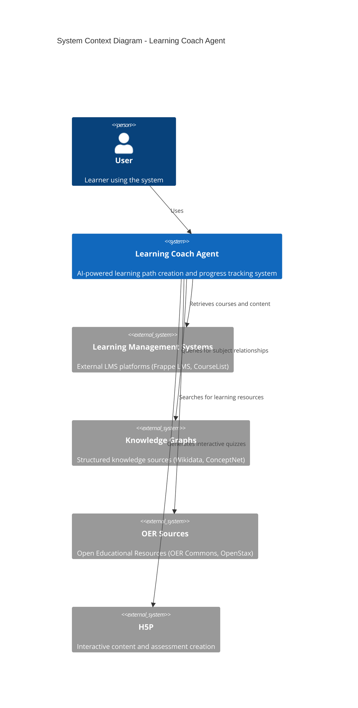
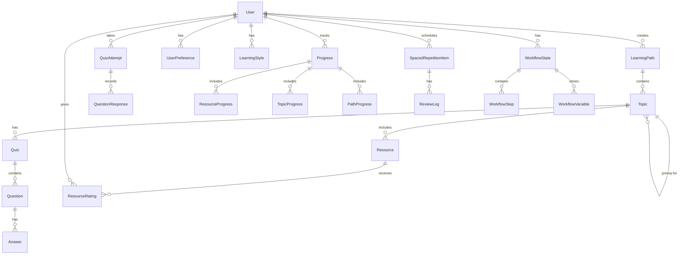
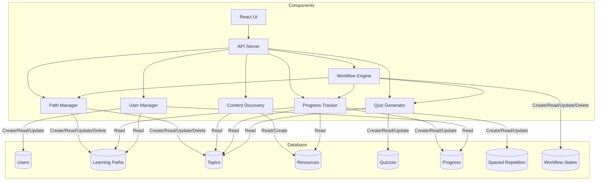
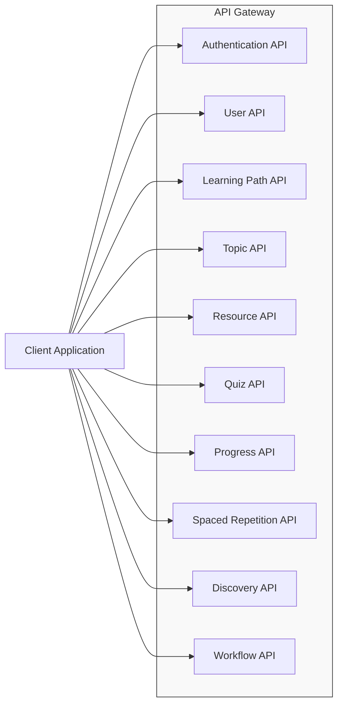
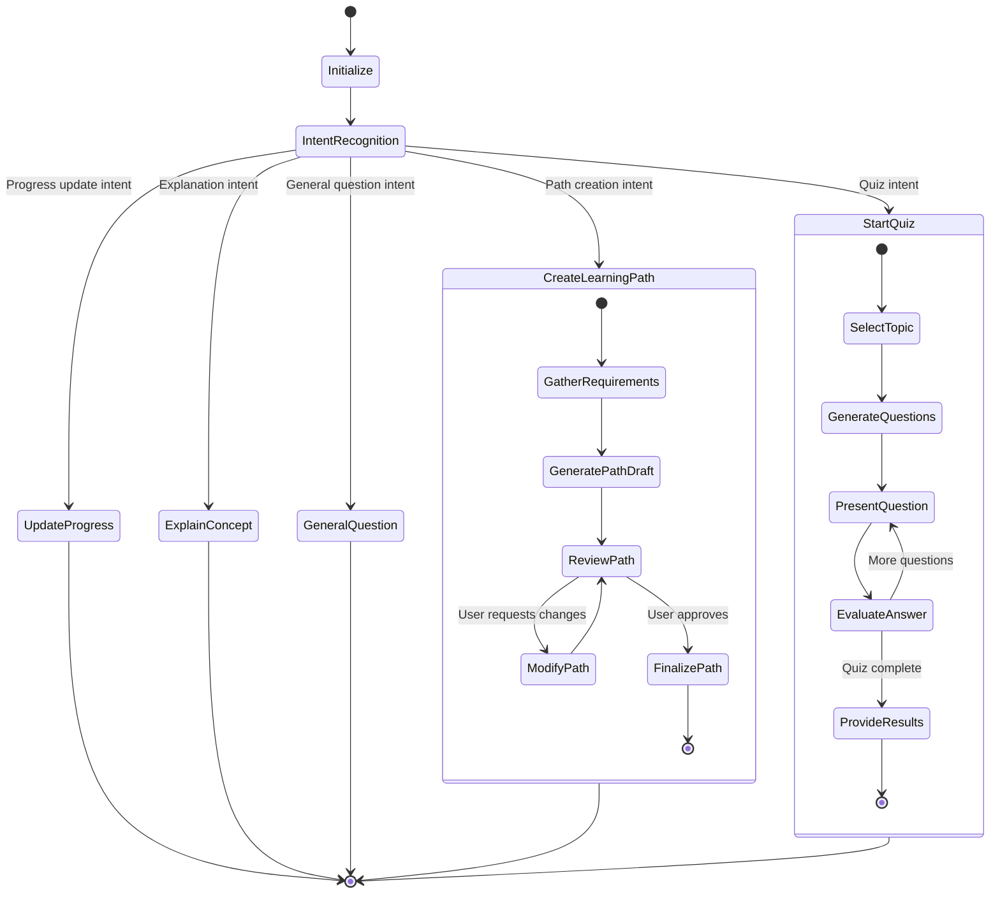
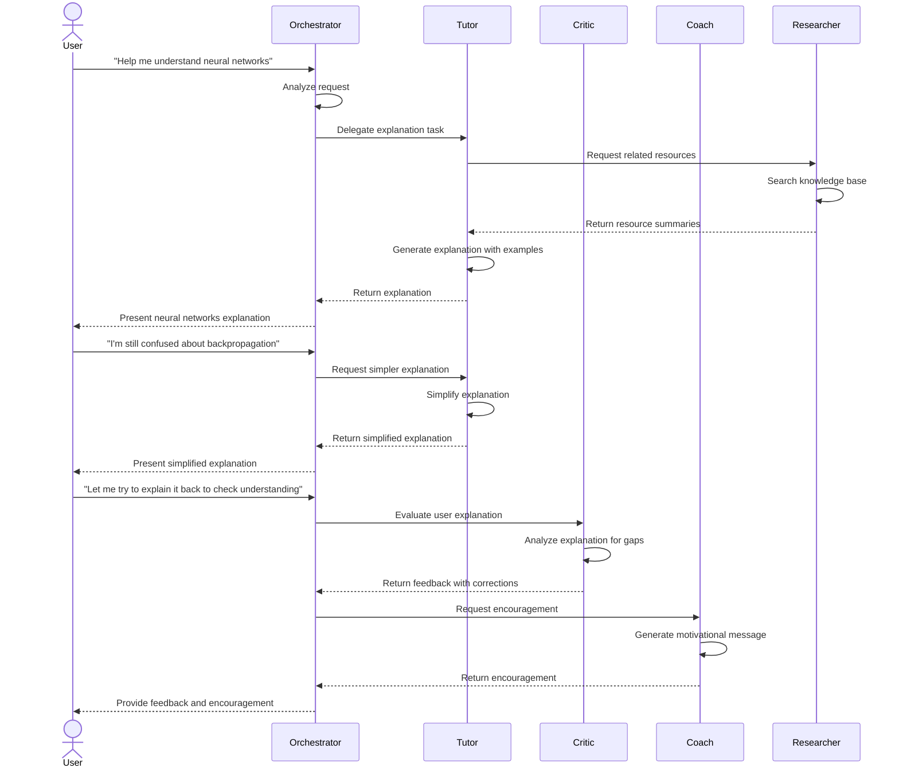
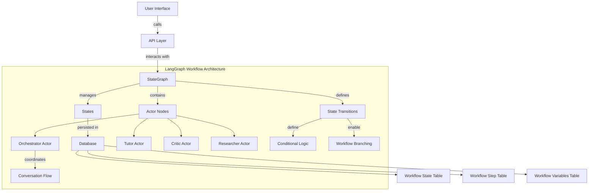
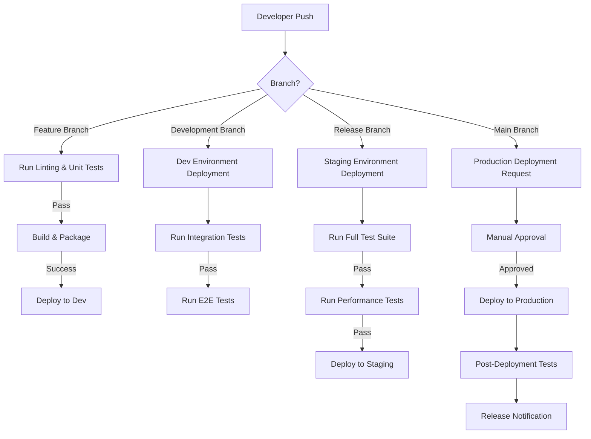
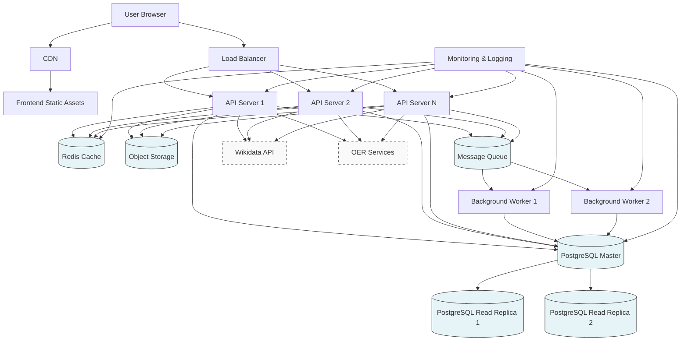

# Day 6: Learning Coach Agent - Technical Specifications

This document provides detailed technical specifications for the Learning Coach agent, including database schema designs, API endpoints, and deployment strategies.

## Table of Contents
1. [System Context](#system-context)
2. [Database Schema](#database-schema)
3. [API Endpoints](#api-endpoints)
4. [User Flows](#user-flows)
5. [Component Interactions](#component-interactions)
6. [Workflow Management](#workflow-management)
7. [Deployment Strategy](#deployment-strategy)

## System Context

The following diagram illustrates how the Learning Coach agent interacts with external systems and users:



### Component View

The following diagram shows the major components of the Learning Coach agent system:

```mermaid
C4Component
    title Component Diagram - Learning Coach Agent

    Container(frontend, "Frontend", "React", "Web application for user interaction")
    Container(apiServer, "API Server", "FastAPI", "Handles HTTP requests and business logic")
    ContainerDb(database, "Database", "PostgreSQL", "Stores user data, learning paths, and progress")
    
    Container_Boundary(coreAgent, "Core Agent") {
        Component(intentRec, "Intent Recognition", "LangChain", "Identifies user intent from natural language")
        Component(workflowEngine, "Workflow Engine", "LangGraph", "Manages stateful, multi-actor workflows")
        Component(pathManager, "Learning Path Manager", "Python", "Creates and manages learning paths")
        Component(contentDiscovery, "Content Discovery", "Python", "Finds and recommends resources")
        Component(progressTracker, "Progress Tracker", "Python", "Monitors learning progress")
        Component(quizGenerator, "Quiz Generator", "Python", "Creates and evaluates quizzes")
        Component(userMemory, "User Memory", "Python", "Maintains user profiles and preferences")
    }
    
    Container_Boundary(integrations, "Integration Layer") {
        Component(lmsConnector, "LMS Connector", "Python", "Connects to Learning Management Systems")
        Component(kgManager, "Knowledge Graph Manager", "Python", "Interfaces with knowledge graphs")
        Component(oerConnector, "OER Connector", "Python", "Accesses Open Educational Resources")
        Component(h5pConnector, "H5P Connector", "Python", "Integrates with H5P for quizzes")
        Component(srEngine, "Spaced Repetition Engine", "Python", "Implements SM-2 algorithm")
    }
    
    Rel(frontend, apiServer, "Uses", "HTTPS/JSON")
    Rel(apiServer, coreAgent, "Uses", "Python API")
    Rel(apiServer, database, "Reads/Writes", "SQL")
    
    Rel(workflowEngine, intentRec, "Uses", "For input processing")
    Rel(workflowEngine, pathManager, "Orchestrates", "Path creation workflows")
    Rel(workflowEngine, quizGenerator, "Orchestrates", "Quiz sessions")
    
    Rel(coreAgent, integrations, "Uses", "Python API")
    Rel(userMemory, database, "Reads/Writes", "SQL")
    Rel(pathManager, database, "Reads/Writes", "SQL")
    Rel(contentDiscovery, database, "Reads/Writes", "SQL")
    Rel(progressTracker, database, "Reads/Writes", "SQL")
    Rel(quizGenerator, database, "Reads/Writes", "SQL")
    Rel(workflowEngine, database, "Reads/Writes", "SQL")
```

## Database Schema

### Entity Relationship Diagram



### Database Access Patterns

The following diagram illustrates how different components access the database:



### Table Schemas

#### User Schema
```sql
CREATE TABLE User (
    id VARCHAR(36) PRIMARY KEY,
    email VARCHAR(255) UNIQUE NOT NULL,
    username VARCHAR(50) UNIQUE NOT NULL,
    password_hash VARCHAR(255) NOT NULL,
    first_name VARCHAR(50),
    last_name VARCHAR(50),
    created_at TIMESTAMP DEFAULT CURRENT_TIMESTAMP,
    last_login TIMESTAMP,
    account_status ENUM('active', 'inactive', 'suspended') DEFAULT 'active',
    profile_image_url VARCHAR(255)
);
```

#### UserPreference Schema
```sql
CREATE TABLE UserPreference (
    id VARCHAR(36) PRIMARY KEY,
    user_id VARCHAR(36) NOT NULL,
    preference_key VARCHAR(50) NOT NULL,
    preference_value TEXT,
    FOREIGN KEY (user_id) REFERENCES User(id) ON DELETE CASCADE,
    UNIQUE KEY unique_user_preference (user_id, preference_key)
);
```

#### LearningStyle Schema
```sql
CREATE TABLE LearningStyle (
    id VARCHAR(36) PRIMARY KEY,
    user_id VARCHAR(36) NOT NULL,
    visual_score INTEGER DEFAULT 0,
    auditory_score INTEGER DEFAULT 0,
    reading_score INTEGER DEFAULT 0,
    kinesthetic_score INTEGER DEFAULT 0,
    social_score INTEGER DEFAULT 0,
    solitary_score INTEGER DEFAULT 0,
    last_assessed TIMESTAMP,
    FOREIGN KEY (user_id) REFERENCES User(id) ON DELETE CASCADE
);
```

#### WorkflowState Schema
```sql
CREATE TABLE WorkflowState (
    id VARCHAR(36) PRIMARY KEY,
    user_id VARCHAR(36) NOT NULL,
    workflow_type VARCHAR(50) NOT NULL,
    workflow_id VARCHAR(36) NOT NULL,
    current_step VARCHAR(50),
    conversation_history JSON,
    created_at TIMESTAMP DEFAULT CURRENT_TIMESTAMP,
    updated_at TIMESTAMP DEFAULT CURRENT_TIMESTAMP ON UPDATE CURRENT_TIMESTAMP,
    expires_at TIMESTAMP,
    is_active BOOLEAN DEFAULT TRUE,
    FOREIGN KEY (user_id) REFERENCES User(id) ON DELETE CASCADE,
    UNIQUE KEY unique_active_workflow (user_id, workflow_type, workflow_id, is_active)
);
```

#### WorkflowStep Schema
```sql
CREATE TABLE WorkflowStep (
    id VARCHAR(36) PRIMARY KEY,
    workflow_state_id VARCHAR(36) NOT NULL,
    step_name VARCHAR(50) NOT NULL,
    step_type VARCHAR(50) NOT NULL,
    step_data JSON,
    completed_at TIMESTAMP,
    next_steps JSON,
    created_at TIMESTAMP DEFAULT CURRENT_TIMESTAMP,
    FOREIGN KEY (workflow_state_id) REFERENCES WorkflowState(id) ON DELETE CASCADE
);
```

#### WorkflowVariable Schema
```sql
CREATE TABLE WorkflowVariable (
    id VARCHAR(36) PRIMARY KEY,
    workflow_state_id VARCHAR(36) NOT NULL,
    variable_name VARCHAR(50) NOT NULL,
    variable_value JSON,
    created_at TIMESTAMP DEFAULT CURRENT_TIMESTAMP,
    updated_at TIMESTAMP DEFAULT CURRENT_TIMESTAMP ON UPDATE CURRENT_TIMESTAMP,
    FOREIGN KEY (workflow_state_id) REFERENCES WorkflowState(id) ON DELETE CASCADE,
    UNIQUE KEY unique_workflow_variable (workflow_state_id, variable_name)
);
```

#### LearningPath Schema
```sql
CREATE TABLE LearningPath (
    id VARCHAR(36) PRIMARY KEY,
    user_id VARCHAR(36) NOT NULL,
    title VARCHAR(255) NOT NULL,
    description TEXT,
    subject_area VARCHAR(100),
    difficulty_level ENUM('beginner', 'intermediate', 'advanced', 'expert'),
    estimated_hours INTEGER,
    created_at TIMESTAMP DEFAULT CURRENT_TIMESTAMP,
    updated_at TIMESTAMP DEFAULT CURRENT_TIMESTAMP ON UPDATE CURRENT_TIMESTAMP,
    is_public BOOLEAN DEFAULT FALSE,
    status ENUM('draft', 'active', 'archived') DEFAULT 'draft',
    FOREIGN KEY (user_id) REFERENCES User(id) ON DELETE CASCADE
);
```

#### Topic Schema
```sql
CREATE TABLE Topic (
    id VARCHAR(36) PRIMARY KEY,
    path_id VARCHAR(36) NOT NULL,
    title VARCHAR(255) NOT NULL,
    description TEXT,
    position INTEGER NOT NULL,
    estimated_hours FLOAT,
    created_at TIMESTAMP DEFAULT CURRENT_TIMESTAMP,
    updated_at TIMESTAMP DEFAULT CURRENT_TIMESTAMP ON UPDATE CURRENT_TIMESTAMP,
    external_source_id VARCHAR(255),
    FOREIGN KEY (path_id) REFERENCES LearningPath(id) ON DELETE CASCADE
);
```

#### TopicPrerequisite Schema
```sql
CREATE TABLE TopicPrerequisite (
    id VARCHAR(36) PRIMARY KEY,
    topic_id VARCHAR(36) NOT NULL,
    prerequisite_id VARCHAR(36) NOT NULL,
    created_at TIMESTAMP DEFAULT CURRENT_TIMESTAMP,
    FOREIGN KEY (topic_id) REFERENCES Topic(id) ON DELETE CASCADE,
    FOREIGN KEY (prerequisite_id) REFERENCES Topic(id) ON DELETE CASCADE,
    UNIQUE KEY unique_topic_prerequisite (topic_id, prerequisite_id)
);
```

#### Resource Schema
```sql
CREATE TABLE Resource (
    id VARCHAR(36) PRIMARY KEY,
    topic_id VARCHAR(36) NOT NULL,
    title VARCHAR(255) NOT NULL,
    description TEXT,
    url VARCHAR(1024),
    resource_type ENUM('article', 'video', 'book', 'course', 'exercise', 'other'),
    source VARCHAR(255),
    estimated_minutes INTEGER,
    difficulty_level ENUM('beginner', 'intermediate', 'advanced', 'expert'),
    created_at TIMESTAMP DEFAULT CURRENT_TIMESTAMP,
    quality_score FLOAT DEFAULT 0,
    external_id VARCHAR(255),
    FOREIGN KEY (topic_id) REFERENCES Topic(id) ON DELETE CASCADE
);
```

#### ResourceRating Schema
```sql
CREATE TABLE ResourceRating (
    id VARCHAR(36) PRIMARY KEY,
    resource_id VARCHAR(36) NOT NULL,
    user_id VARCHAR(36) NOT NULL,
    rating INTEGER NOT NULL,
    feedback TEXT,
    created_at TIMESTAMP DEFAULT CURRENT_TIMESTAMP,
    FOREIGN KEY (resource_id) REFERENCES Resource(id) ON DELETE CASCADE,
    FOREIGN KEY (user_id) REFERENCES User(id) ON DELETE CASCADE,
    UNIQUE KEY unique_user_resource_rating (user_id, resource_id)
);
```

#### Quiz Schema
```sql
CREATE TABLE Quiz (
    id VARCHAR(36) PRIMARY KEY,
    topic_id VARCHAR(36) NOT NULL,
    title VARCHAR(255) NOT NULL,
    description TEXT,
    difficulty_level ENUM('beginner', 'intermediate', 'advanced', 'expert'),
    time_limit_minutes INTEGER,
    pass_threshold FLOAT,
    created_at TIMESTAMP DEFAULT CURRENT_TIMESTAMP,
    updated_at TIMESTAMP DEFAULT CURRENT_TIMESTAMP ON UPDATE CURRENT_TIMESTAMP,
    is_adaptive BOOLEAN DEFAULT FALSE,
    FOREIGN KEY (topic_id) REFERENCES Topic(id) ON DELETE CASCADE
);
```

#### Question Schema
```sql
CREATE TABLE Question (
    id VARCHAR(36) PRIMARY KEY,
    quiz_id VARCHAR(36) NOT NULL,
    question_text TEXT NOT NULL,
    question_type ENUM('multiple_choice', 'true_false', 'short_answer', 'essay', 'matching'),
    difficulty_level ENUM('easy', 'medium', 'hard'),
    points INTEGER DEFAULT 1,
    position INTEGER,
    explanation TEXT,
    created_at TIMESTAMP DEFAULT CURRENT_TIMESTAMP,
    FOREIGN KEY (quiz_id) REFERENCES Quiz(id) ON DELETE CASCADE
);
```

#### Answer Schema
```sql
CREATE TABLE Answer (
    id VARCHAR(36) PRIMARY KEY,
    question_id VARCHAR(36) NOT NULL,
    answer_text TEXT NOT NULL,
    is_correct BOOLEAN NOT NULL DEFAULT FALSE,
    explanation TEXT,
    position INTEGER,
    FOREIGN KEY (question_id) REFERENCES Question(id) ON DELETE CASCADE
);
```

#### QuizAttempt Schema
```sql
CREATE TABLE QuizAttempt (
    id VARCHAR(36) PRIMARY KEY,
    quiz_id VARCHAR(36) NOT NULL,
    user_id VARCHAR(36) NOT NULL,
    started_at TIMESTAMP DEFAULT CURRENT_TIMESTAMP,
    completed_at TIMESTAMP,
    score FLOAT,
    time_spent_seconds INTEGER,
    passed BOOLEAN,
    FOREIGN KEY (quiz_id) REFERENCES Quiz(id) ON DELETE CASCADE,
    FOREIGN KEY (user_id) REFERENCES User(id) ON DELETE CASCADE
);
```

#### QuestionResponse Schema
```sql
CREATE TABLE QuestionResponse (
    id VARCHAR(36) PRIMARY KEY,
    question_id VARCHAR(36) NOT NULL,
    quiz_attempt_id VARCHAR(36) NOT NULL,
    answer_id VARCHAR(36),
    user_answer_text TEXT,
    is_correct BOOLEAN,
    points_earned FLOAT,
    response_time_seconds INTEGER,
    FOREIGN KEY (question_id) REFERENCES Question(id) ON DELETE CASCADE,
    FOREIGN KEY (quiz_attempt_id) REFERENCES QuizAttempt(id) ON DELETE CASCADE,
    FOREIGN KEY (answer_id) REFERENCES Answer(id) ON DELETE SET NULL
);
```

#### Progress Schema
```sql
CREATE TABLE Progress (
    id VARCHAR(36) PRIMARY KEY,
    user_id VARCHAR(36) NOT NULL,
    path_id VARCHAR(36) NOT NULL,
    started_at TIMESTAMP DEFAULT CURRENT_TIMESTAMP,
    last_activity_at TIMESTAMP,
    completion_percentage FLOAT DEFAULT 0,
    is_completed BOOLEAN DEFAULT FALSE,
    completed_at TIMESTAMP,
    FOREIGN KEY (user_id) REFERENCES User(id) ON DELETE CASCADE,
    FOREIGN KEY (path_id) REFERENCES LearningPath(id) ON DELETE CASCADE,
    UNIQUE KEY unique_user_path_progress (user_id, path_id)
);
```

#### TopicProgress Schema
```sql
CREATE TABLE TopicProgress (
    id VARCHAR(36) PRIMARY KEY,
    progress_id VARCHAR(36) NOT NULL,
    topic_id VARCHAR(36) NOT NULL,
    started_at TIMESTAMP DEFAULT CURRENT_TIMESTAMP,
    completion_percentage FLOAT DEFAULT 0,
    is_completed BOOLEAN DEFAULT FALSE,
    completed_at TIMESTAMP,
    time_spent_seconds INTEGER DEFAULT 0,
    FOREIGN KEY (progress_id) REFERENCES Progress(id) ON DELETE CASCADE,
    FOREIGN KEY (topic_id) REFERENCES Topic(id) ON DELETE CASCADE,
    UNIQUE KEY unique_progress_topic (progress_id, topic_id)
);
```

#### ResourceProgress Schema
```sql
CREATE TABLE ResourceProgress (
    id VARCHAR(36) PRIMARY KEY,
    progress_id VARCHAR(36) NOT NULL,
    resource_id VARCHAR(36) NOT NULL,
    started_at TIMESTAMP DEFAULT CURRENT_TIMESTAMP,
    last_accessed_at TIMESTAMP,
    completion_percentage FLOAT DEFAULT 0,
    is_completed BOOLEAN DEFAULT FALSE,
    completed_at TIMESTAMP,
    time_spent_seconds INTEGER DEFAULT 0,
    FOREIGN KEY (progress_id) REFERENCES Progress(id) ON DELETE CASCADE,
    FOREIGN KEY (resource_id) REFERENCES Resource(id) ON DELETE CASCADE,
    UNIQUE KEY unique_progress_resource (progress_id, resource_id)
);
```

#### SpacedRepetitionItem Schema
```sql
CREATE TABLE SpacedRepetitionItem (
    id VARCHAR(36) PRIMARY KEY,
    user_id VARCHAR(36) NOT NULL,
    topic_id VARCHAR(36) NOT NULL,
    question_id VARCHAR(36),
    created_at TIMESTAMP DEFAULT CURRENT_TIMESTAMP,
    next_review_date TIMESTAMP NOT NULL,
    ease_factor FLOAT DEFAULT 2.5,
    interval_days INTEGER DEFAULT 0,
    repetition_number INTEGER DEFAULT 0,
    FOREIGN KEY (user_id) REFERENCES User(id) ON DELETE CASCADE,
    FOREIGN KEY (topic_id) REFERENCES Topic(id) ON DELETE CASCADE,
    FOREIGN KEY (question_id) REFERENCES Question(id) ON DELETE SET NULL
);
```

#### ReviewLog Schema
```sql
CREATE TABLE ReviewLog (
    id VARCHAR(36) PRIMARY KEY,
    item_id VARCHAR(36) NOT NULL,
    review_date TIMESTAMP DEFAULT CURRENT_TIMESTAMP,
    quality_response INTEGER NOT NULL, -- 0-5 rating
    ease_factor FLOAT NOT NULL,
    interval_days INTEGER NOT NULL,
    repetition_number INTEGER NOT NULL,
    FOREIGN KEY (item_id) REFERENCES SpacedRepetitionItem(id) ON DELETE CASCADE
);
```

## API Endpoints

The following diagram illustrates the API architecture:



The following section outlines the API endpoints for the Learning Coach agent. All endpoints use JSON for request and response bodies unless otherwise specified.

### Authentication Endpoints

#### POST /api/auth/register
Create a new user account

**Request Body:**
```json
{
  "email": "user@example.com",
  "username": "username",
  "password": "secure_password",
  "first_name": "John",
  "last_name": "Doe"
}
```

**Response:**
```json
{
  "id": "user-uuid",
  "email": "user@example.com",
  "username": "username",
  "first_name": "John",
  "last_name": "Doe",
  "created_at": "2025-05-10T14:30:00Z"
}
```

### Workflow Management Endpoints

#### POST /api/workflows/start
Start a new workflow of a specific type

**Request Body:**
```json
{
  "workflow_type": "learning_path_creation",
  "initial_data": {
    "subject": "machine learning",
    "goal": "build a recommendation system"
  }
}
```

**Response:**
```json
{
  "workflow_id": "workflow-uuid",
  "workflow_type": "learning_path_creation",
  "current_step": "gather_requirements",
  "next_action": "provide_subject_details",
  "message": "Let's create a learning path for machine learning. Could you tell me more about your current knowledge level?",
  "expires_at": "2025-05-13T12:00:00Z"
}
```

#### PUT /api/workflows/{workflow_id}/advance
Advance a workflow to the next step

**Request Body:**
```json
{
  "user_input": "I'm a beginner with some basic Python knowledge",
  "current_step": "gather_requirements"
}
```

**Response:**
```json
{
  "workflow_id": "workflow-uuid",
  "workflow_type": "learning_path_creation",
  "current_step": "generate_path_draft",
  "next_action": "review_path_draft",
  "message": "Based on your input, I've created a draft learning path for machine learning. Please review the following topics...",
  "data": {
    "path_draft": {
      "title": "Machine Learning for Recommendation Systems",
      "topics": [
        {
          "title": "Python for Data Science",
          "description": "Essential Python skills for ML"
        },
        // Additional topics...
      ]
    }
  },
  "expires_at": "2025-05-13T12:00:00Z"
}
```

#### GET /api/workflows/{workflow_id}/state
Get the current state of a workflow

**Response:**
```json
{
  "workflow_id": "workflow-uuid",
  "workflow_type": "learning_path_creation",
  "current_step": "generate_path_draft",
  "created_at": "2025-05-12T11:30:00Z",
  "updated_at": "2025-05-12T11:35:00Z",
  "variables": {
    "subject": "machine learning",
    "goal": "build a recommendation system",
    "knowledge_level": "beginner",
    "has_python_experience": true
  },
  "conversation_history": [
    {
      "role": "system",
      "content": "Starting learning path creation workflow"
    },
    {
      "role": "assistant",
      "content": "Let's create a learning path for machine learning. Could you tell me more about your current knowledge level?"
    },
    {
      "role": "user",
      "content": "I'm a beginner with some basic Python knowledge"
    }
  ],
  "expires_at": "2025-05-13T12:00:00Z"
}
```

#### DELETE /api/workflows/{workflow_id}
Cancel and delete a workflow

**Response:**
```json
{
  "success": true,
  "message": "Workflow has been cancelled and deleted"
}
```

## User Flows

The following diagrams illustrate key user flows in the system:

### LangGraph Conversation Flow



### Multi-Actor System Flow



## Workflow Management

The LangGraph workflow engine provides a robust framework for managing complex, stateful interactions in the Learning Coach agent. This section details how workflows are structured and managed.

### Workflow Architecture



### Workflow Types

The Learning Coach agent uses several workflow types managed by LangGraph:

1. **Learning Path Creation**
   - Multi-step process for creating personalized learning paths
   - Handles gathering requirements, generating path drafts, and finalizing paths
   - Maintains context through multiple interaction turns

2. **Quiz Session**
   - Manages the state of an active quiz
   - Tracks questions, answers, and progress
   - Provides adaptive difficulty based on user performance

3. **Concept Explanation**
   - Multi-actor workflow involving the Tutor and Researcher
   - Maintains context of what's been explained and user's comprehension
   - Enables follow-up questions with context

4. **Progress Review**
   - Analyzes user progress across learning paths
   - Provides personalized recommendations
   - Schedules spaced repetition reviews

### State Management

LangGraph provides sophisticated state management capabilities:

1. **Persistent State**
   - Workflow state persisted in database
   - Allows long-running conversations across sessions
   - Supports resumption of workflows after interruptions

2. **Context Management**
   - Maintains conversation history
   - Preserves key variables and user inputs
   - Enables contextual understanding of user requests

3. **Multi-Actor Coordination**
   - Coordinates between specialized agents
   - Manages handoffs between different agent roles
   - Preserves context across agent transitions

### Implementation Details

```python
# Example LangGraph workflow definition
from langgraph.graph import StateGraph, START, END
from typing import Dict, Any

# Define state schema
class WorkflowState(TypedDict):
    conversation: List[Dict[str, str]]
    variables: Dict[str, Any]
    current_step: str

# Create nodes for each actor
def orchestrator(state: WorkflowState) -> Dict:
    # Logic to analyze state and route to appropriate actor
    # or to determine next step in workflow
    pass

def tutor(state: WorkflowState) -> Dict:
    # Logic to provide explanations and educational content
    pass

def critic(state: WorkflowState) -> Dict:
    # Logic to evaluate user responses
    pass

# Define state transitions
def should_route_to_tutor(state: WorkflowState) -> bool:
    # Logic to determine if request should go to tutor
    pass

# Build the workflow graph
workflow = StateGraph(WorkflowState)
workflow.add_node("orchestrator", orchestrator)
workflow.add_node("tutor", tutor)
workflow.add_node("critic", critic)

# Add edges with conditional logic
workflow.add_edge(START, "orchestrator")
workflow.add_conditional_edges(
    "orchestrator",
    should_route_to_tutor,
    {
        True: "tutor",
        False: "critic"
    }
)
workflow.add_edge("tutor", "orchestrator")
workflow.add_edge("critic", "orchestrator")
workflow.add_edge("orchestrator", END)

# Compile the graph
app = workflow.compile()
```

## Deployment Strategy

This section outlines the deployment strategy for the Learning Coach agent, including environments, CI/CD pipeline, and infrastructure requirements.

### Deployment Environments

The Learning Coach agent will be deployed across multiple environments to ensure proper testing and validation before reaching production.

```mermaid
flowchart LR
    classDef devEnv fill:#d4f4d4,stroke:#333
    classDef stagingEnv fill:#f9edb2,stroke:#333
    classDef prodEnv fill:#f9c4c4,stroke:#333
    
    subgraph Local["Local Development"]
        L_BE[Backend]
        L_FE[Frontend]
        L_DB[(SQLite)]
    end
    
    subgraph Dev["Development Environment"]
        D_BE[Backend]
        D_FE[Frontend]
        D_DB[(PostgreSQL)]
        D_Mock[Mock Integrations]
    end
    
    subgraph Staging["Staging Environment"]
        S_BE[Backend]
        S_FE[Frontend]
        S_DB[(PostgreSQL)]
        S_Int[Staging Integrations]
        S_Monitoring[Monitoring]
    end
    
    subgraph Prod["Production Environment"]
        P_BE[Backend]
        P_FE[Frontend]
        P_DB_Primary[(PostgreSQL Primary)]
        P_DB_Replica[(PostgreSQL Replicas)]
        P_Cache[(Redis Cache)]
        P_Int[Production Integrations]
        P_Monitoring[Monitoring & Alerting]
        P_CDN[CDN]
    end
    
    Developer --> Local
    Local --> |Git Push| Dev
    Dev --> |Release| Staging
    Staging --> |Approval| Prod
    
    class Local devEnv
    class Dev devEnv
    class Staging stagingEnv
    class Prod prodEnv
```



### LangGraph-Specific Deployment Considerations

When deploying LangGraph-based workflows, special consideration should be given to:

1. **State Persistence**
   - Ensure database is configured for efficient storage and retrieval of workflow states
   - Consider partitioning or sharding for large-scale deployments
   - Implement state cleanup for expired or completed workflows

2. **Memory Management**
   - Monitor memory usage as complex workflows may require significant memory
   - Implement memory limits for individual workflows
   - Consider workflow timeouts to prevent resource exhaustion

3. **Scaling**
   - Deploy workflow processing as horizontally scalable services
   - Use message queues for asynchronous workflow processing
   - Implement distributed locking for concurrent workflow access

4. **Monitoring**
   - Add LangGraph-specific metrics to monitoring system
   - Track workflow completion rates and error rates
   - Monitor state size and workflow duration

### CI/CD Pipeline



### Infrastructure Requirements

#### Production Infrastructure Architecture



#### LangGraph Worker Requirements
The LangGraph implementation requires specialized worker processes to handle stateful workflows:

- **Compute**: 4-8 vCPUs, 8-16 GB RAM per worker
- **Scaling**: Auto-scaling based on workflow queue depth
- **Storage**: Fast local SSD for temporary storage
- **Memory**: High memory allocation for complex workflows
- **Network**: Low-latency connection to database and API servers

### Monitoring for LangGraph Workflows

Specific monitoring should be implemented for LangGraph workflows:

1. **Workflow Metrics**
   - Active workflows by type
   - Workflow completion time
   - Error rates by workflow step
   - State size and complexity

2. **Actor Performance**
   - Time spent in each actor node
   - Success/failure rates by actor
   - Model call metrics per actor

3. **Resource Utilization**
   - Memory usage per workflow
   - Database operations
   - Model inference time

4. **User Experience**
   - Time to first response
   - Total workflow completion time
   - User satisfaction metrics

## Conclusion

This technical specification document provides a comprehensive blueprint for implementing the Learning Coach agent, including detailed database schemas, API endpoints, workflow management, and deployment strategies. The inclusion of LangGraph provides powerful capabilities for stateful, multi-actor workflows that enable sophisticated learning interactions. This document should be used as a reference throughout the development process to ensure consistency and completeness of implementation.