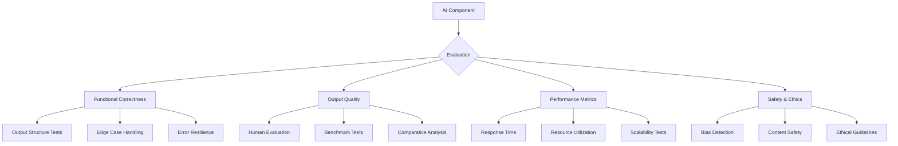
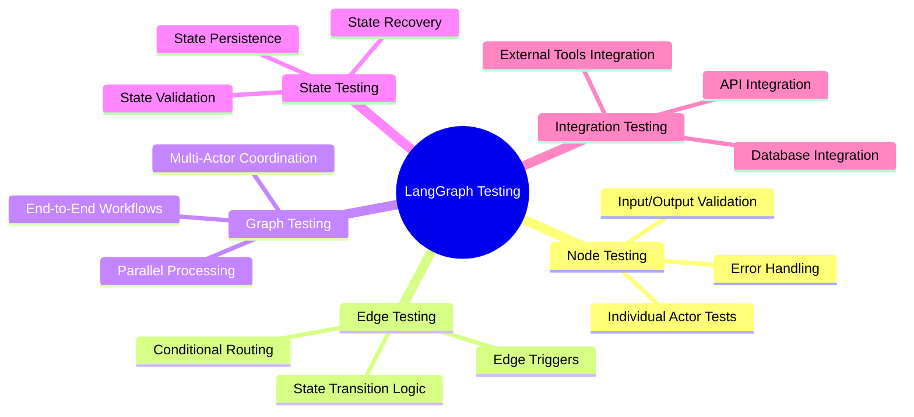
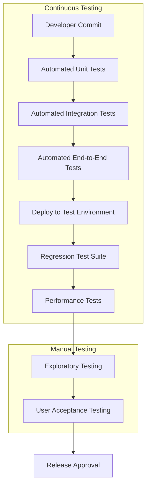
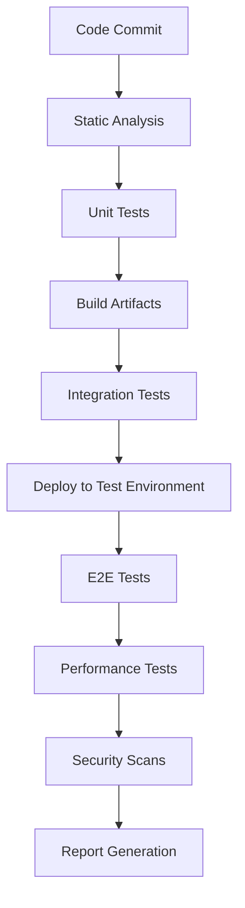
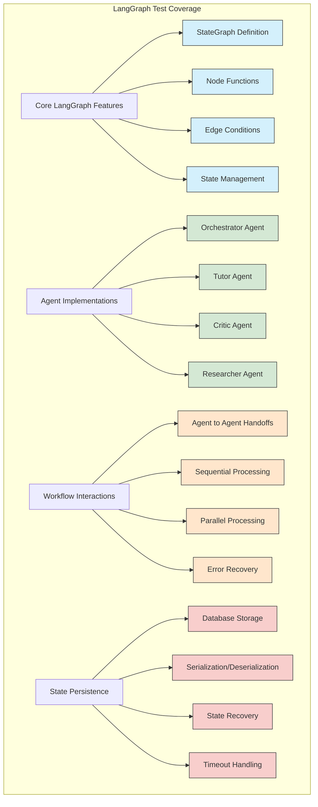

# Testing Strategy for Learning Coach Agent

This document outlines the comprehensive testing strategy for the Learning Coach agent, with special consideration for AI components, multi-actor systems, and LangGraph workflows.

## Table of Contents
1. [Testing Principles](#testing-principles)
2. [Testing Pyramid](#testing-pyramid)
3. [Test Types](#test-types)
4. [AI and LLM Testing](#ai-and-llm-testing)
5. [LangGraph Workflow Testing](#langgraph-workflow-testing)
6. [Test Environments](#test-environments)
7. [Test Automation](#test-automation)
8. [Tools and Frameworks](#tools-and-frameworks)
9. [Test Data Management](#test-data-management)
10. [Continuous Integration](#continuous-integration)
11. [Performance and Load Testing](#performance-and-load-testing)
12. [Security Testing](#security-testing)
13. [Accessibility Testing](#accessibility-testing)
14. [User Acceptance Testing](#user-acceptance-testing)
15. [Test Metrics and Reporting](#test-metrics-and-reporting)

## Testing Principles

Our testing approach is guided by the following principles:

1. **Early and Continuous Testing**: Testing begins in the development phase and continues throughout the development lifecycle.

2. **Shift-Left Testing**: Testing activities are moved earlier in the development cycle to identify issues sooner.

3. **Automated Testing**: Automate as much as possible to enable fast feedback loops and continuous testing.

4. **Deterministic Testing**: Tests should be reliable and produce consistent results.

5. **Isolation**: Tests should be isolated and not depend on the presence or state of other tests.

6. **Clear Purpose**: Each test should have a clear purpose and test a specific functionality.

7. **Test Coverage Balanced with Practicality**: Aim for comprehensive test coverage while balancing the cost of writing and maintaining tests.

8. **Adaptivity for AI Components**: Special techniques for testing non-deterministic AI components.

## Testing Pyramid

Our testing strategy follows the testing pyramid approach, with more emphasis on lower-level tests due to their speed and reliability, while still maintaining sufficient higher-level tests to ensure integration quality.

```mermaid
pyramid
    title Testing Pyramid for Learning Coach
    section Exploratory Testing
        Manual Exploratory Testing: 5
    section E2E Testing
        UI End-to-End Tests: 10
        API End-to-End Tests: 15
    section Integration Testing
        Component Integration Tests: 20
        API Integration Tests: 25
        Workflow Integration Tests: 30
    section Unit Testing
        Frontend Unit Tests: 50
        Backend Unit Tests: 50
        AI Component Unit Tests: 30
```

## Test Types

### Unit Tests

Unit tests verify individual components in isolation. For the Learning Coach agent, unit tests will cover:

- **Backend Components**:
  - Python service classes and functions
  - API route handlers
  - Database models and queries
  - AI component functions (with appropriate mocking)
  - Utility functions

- **Frontend Components**:
  - React components
  - Custom hooks
  - State management functions
  - Utility functions
  - API service functions

### Component Integration Tests

Component integration tests verify interactions between related components:

- **Backend Integration**:
  - Service to service interaction
  - Database interaction
  - External API interaction (with mocks)
  - AI component integration with other services

- **Frontend Integration**:
  - Component composition
  - Context provider integration
  - Navigation flows

### API Integration Tests

API integration tests verify the API endpoints function correctly:

- HTTP status codes
- Response body structure
- Error handling
- Authentication and authorization
- API contract validation

### Workflow Integration Tests

Workflow integration tests verify end-to-end business processes:

- Learning path creation workflow
- Quiz session workflow
- Progress tracking workflow
- Multi-actor conversation workflows

### End-to-End Tests

End-to-end tests verify the system works correctly from user perspective:

- User registration and login
- Learning path creation and navigation
- Content consumption
- Quiz taking
- Progress tracking and visualization

### Exploratory Testing

Manual testing to discover edge cases and issues that automated tests might miss:

- Usability issues
- Visual consistency
- Complex interaction patterns
- Edge case scenarios

## AI and LLM Testing

Testing AI components requires specialized approaches due to their non-deterministic nature.

### Evaluation Framework



### LLM Testing Strategies

1. **Input/Output Contract Testing**:
   - Ensure outputs maintain expected structure regardless of exact content
   - Validate presence of required fields and adherence to schemas
   - Test handling of edge cases (empty inputs, very long inputs, etc.)

2. **Golden Dataset Testing**:
   - Create a dataset of exemplar inputs and expected outputs
   - Run regular regression tests against this dataset
   - Measure semantic similarity rather than exact matching

3. **Prompt Template Testing**:
   - Test variations of prompts for robustness
   - Ensure prompt changes don't break downstream processing
   - Version control prompt templates

4. **Semantic Evaluation**:
   - Test semantic correctness rather than exact text matching
   - Use embedding similarity metrics
   - Implement automatic evaluation using evaluation LLMs

5. **Adversarial Testing**:
   - Attempt to cause harmful, inappropriate, or incorrect outputs
   - Test prompt injection attacks
   - Test with malformed or unexpected inputs

6. **Simulation Testing**:
   - Create simulated user interactions
   - Test multi-turn conversations
   - Validate conversation flow and context retention

## LangGraph Workflow Testing

LangGraph workflows require specialized testing strategies due to their stateful nature and complex interactions.

### Workflow Test Categories



### Testing Strategies for LangGraph

1. **Node (Actor) Testing**:
   - Test each actor node in isolation with fixed inputs
   - Verify expected outputs are produced
   - Test error handling
   - Mock dependencies and external calls

2. **Edge Testing**:
   - Test conditional routing logic between nodes
   - Verify correct next node selection based on state
   - Test with boundary conditions

3. **State Testing**:
   - Verify state is correctly maintained between nodes
   - Test state serialization and deserialization
   - Test with minimal and maximal state objects
   - Verify state schema validation

4. **Graph Testing**:
   - Test complete workflow execution
   - Verify expected final states are reached
   - Test with various initial conditions
   - Verify correct handling of conversation context

5. **Multi-Actor Testing**:
   - Test handoffs between different actors
   - Verify context preservation during transitions
   - Test fallback mechanisms
   - Verify orchestration logic

6. **Persistence Testing**:
   - Test workflow persistence and resumption
   - Verify state can be saved and restored
   - Test timeout and expiration handling
   - Verify cleanup of completed workflows

### LangGraph Test Implementation

```python
# Example: Testing a LangGraph workflow node
def test_tutor_node():
    # Prepare test input state
    test_state = {
        "conversation": [
            {"role": "user", "content": "Explain neural networks"}
        ],
        "variables": {
            "subject": "neural networks",
            "knowledge_level": "beginner"
        },
        "current_step": "explanation"
    }
    
    # Execute node
    result = tutor_node(test_state)
    
    # Assert on result structure
    assert "conversation" in result
    assert len(result["conversation"]) > len(test_state["conversation"])
    assert result["conversation"][-1]["role"] == "assistant"
    assert "neural networks" in result["conversation"][-1]["content"].lower()
    
    # Assert on expected state changes
    assert result["current_step"] == "awaiting_feedback"
    
# Example: Testing workflow state transitions
def test_orchestrator_routing():
    # Prepare test states
    explanation_request = {
        "conversation": [
            {"role": "user", "content": "Explain neural networks"}
        ],
        "variables": {},
        "current_step": "initial"
    }
    
    quiz_request = {
        "conversation": [
            {"role": "user", "content": "Quiz me on neural networks"}
        ],
        "variables": {},
        "current_step": "initial"
    }
    
    # Get routing decisions
    explanation_route = should_route_to_tutor(explanation_request)
    quiz_route = should_route_to_tutor(quiz_request)
    
    # Assert correct routing
    assert explanation_route is True  # Should route to tutor
    assert quiz_route is False  # Should route to quiz generator
```

## Test Environments

Multiple test environments ensure thorough testing across different conditions.

```mermaid
graph LR
    Dev[Developer Environment]
    CI[CI Environment]
    Test[Test Environment]
    Staging[Staging Environment]
    Prod[Production]
    
    Dev -->|Unit & Component Tests| CI
    CI -->|Integration Tests| Test
    Test -->|E2E Tests| Staging
    Staging -->|UAT & Performance Tests| Prod
    
    style Dev fill:#d1f0ee
    style CI fill:#d1f0ee
    style Test fill:#e4f0d1
    style Staging fill:#f9edbf
    style Prod fill:#f9d0bf
```



### Local Development Environment
- Individual developer machines
- Unit tests and component tests
- Mock external dependencies
- SQLite database

### CI Environment
- Automated testing environment
- Runs on each pull request/commit
- Full suite of unit and integration tests
- Test database with sample data
- Mocked external services

### Test Environment
- Shared testing environment
- Complete integration test suite
- Connected to test instances of external services
- Test database with comprehensive test data

### Staging Environment
- Production-like environment
- End-to-end test suite
- Performance and load testing
- Staging instances of external services
- Anonymized production-like data

## Test Automation

Automation is essential for maintaining quality while enabling rapid development.

### Automation Strategy



### Test Automation Levels

1. **Unit Test Automation**:
   - Pytest for Python backend
   - Jest for React frontend
   - Automated via pre-commit hooks and CI

2. **Integration Test Automation**:
   - API tests with pytest-httpx
   - Component integration tests
   - Database integration tests
   - Workflow tests with LangGraph test utilities

3. **End-to-End Test Automation**:
   - Frontend E2E tests with Playwright
   - API E2E tests with pytest
   - Workflow E2E tests

4. **Performance Test Automation**:
   - Regular performance benchmark tests
   - Load testing with Locust
   - LLM response time monitoring

## Tools and Frameworks

### Backend Testing Tools
- **Pytest**: Core testing framework
- **pytest-asyncio**: For testing async code
- **pytest-httpx**: For testing HTTP clients
- **pytest-mock**: For mocking
- **pytest-cov**: For code coverage
- **LangChain test utilities**: For testing LangChain components
- **LangGraph test utilities**: For testing LangGraph workflows

### Frontend Testing Tools
- **Jest**: Unit testing framework
- **React Testing Library**: Component testing
- **MSW (Mock Service Worker)**: API mocking
- **Cypress/Playwright**: End-to-end testing

### API Testing Tools
- **Postman/Newman**: API testing and collection running
- **Swagger/OpenAPI**: API contract validation

### Performance Testing Tools
- **Locust**: Load testing
- **Prometheus**: Metrics collection
- **Grafana**: Metrics visualization

### Test Data Management
- **Faker**: Generate realistic test data
- **pytest-fixtures**: Manage test data setup and teardown
- **Database seeding scripts**: Prepare test databases

## Test Data Management

Effective test data management ensures consistent and appropriate test conditions.

### Test Data Strategy

1. **Test Data Generation**:
   - Programmatically generate test data using Faker
   - Create domain-specific generators for learning content
   - Generate conversational data for LLM testing

2. **Test Data Storage**:
   - Store test data fixtures in version control
   - Use database seeding scripts for test environment setup
   - Maintain golden datasets for LLM testing

3. **Test Database Management**:
   - Isolated test databases for each environment
   - Database reset between test runs
   - Database migrations testing

4. **Sensitive Data Handling**:
   - No production data in test environments
   - Anonymization of any production-derived data
   - Secure storage of test credentials

### Test Fixtures

```python
# Example fixture for a learning path
@pytest.fixture
def sample_learning_path():
    return {
        "id": "test-path-1",
        "title": "Introduction to Machine Learning",
        "description": "A beginner's path to ML concepts",
        "subject_area": "Data Science",
        "difficulty_level": "beginner",
        "topics": [
            {
                "id": "topic-1",
                "title": "What is Machine Learning?",
                "position": 1
            },
            {
                "id": "topic-2",
                "title": "Types of Machine Learning",
                "position": 2
            }
        ]
    }

# Example fixture for workflow state
@pytest.fixture
def learning_path_workflow_state():
    return {
        "conversation": [
            {"role": "system", "content": "You are a helpful learning coach."},
            {"role": "user", "content": "I want to learn machine learning"}
        ],
        "variables": {
            "subject": "machine learning",
            "user_level": "beginner"
        },
        "current_step": "gather_requirements"
    }
```

## Continuous Integration

Continuous integration ensures tests are run automatically and consistently.

### CI Pipeline



### CI Stages

1. **Code Quality**:
   - Linting with flake8, eslint
   - Type checking with mypy, TypeScript
   - Code formatting checks

2. **Unit Testing**:
   - Backend unit tests with pytest
   - Frontend unit tests with Jest
   - Coverage reports

3. **Integration Testing**:
   - API integration tests
   - Component integration tests
   - Workflow tests

4. **End-to-End Testing**:
   - Frontend E2E tests
   - Full workflow tests
   - Cross-browser testing

5. **Performance Testing**:
   - Load tests for critical paths
   - Response time benchmarks

6. **Security Testing**:
   - Dependency vulnerability scanning
   - SAST (Static Application Security Testing)
   - API security tests

## Performance and Load Testing

Performance testing ensures the system functions efficiently under expected and peak loads.

### Performance Test Areas

1. **API Performance**:
   - Response time for critical endpoints
   - Throughput under various loads
   - Database query performance

2. **LLM Performance**:
   - Model response times
   - Token usage optimization
   - Caching effectiveness

3. **LangGraph Performance**:
   - Workflow execution time
   - State size impact on performance
   - Database operations for state management

4. **Frontend Performance**:
   - Page load time
   - Time to interactive
   - Client-side rendering performance

### Load Testing Scenarios

1. **Normal Load**:
   - Simulate expected user traffic
   - Measure response times and resource usage

2. **Peak Load**:
   - Simulate maximum expected concurrent users
   - Ensure system stability and acceptable performance

3. **Stress Testing**:
   - Push system beyond expected capacity
   - Identify breaking points and failure modes

4. **Endurance Testing**:
   - Run at moderate load for extended periods
   - Detect memory leaks and resource exhaustion

## Security Testing

Security testing ensures the application protects user data and resists common attack vectors.

### Security Test Areas

1. **Authentication & Authorization**:
   - Login security
   - Token management
   - Role-based access control
   - Session management

2. **Data Protection**:
   - Encryption testing
   - Data access controls
   - Privacy compliance

3. **API Security**:
   - Input validation
   - Rate limiting
   - CSRF protection
   - JWT security

4. **Vulnerability Testing**:
   - SQL injection
   - XSS vulnerabilities
   - CSRF vulnerabilities
   - Dependency vulnerabilities

5. **AI-Specific Security**:
   - Prompt injection attacks
   - Model-specific vulnerabilities
   - Output filtering and safety

## Accessibility Testing

Accessibility testing ensures the application is usable by people with disabilities.

### Accessibility Test Areas

1. **Screen Reader Compatibility**:
   - Proper semantic HTML
   - ARIA attributes
   - Keyboard navigation

2. **Visual Accessibility**:
   - Color contrast
   - Text sizing
   - Zoom compatibility

3. **Input Methods**:
   - Keyboard-only usage
   - Alternative input support
   - Touch target sizes

4. **Content Accessibility**:
   - Alt text for images
   - Captions for videos
   - Transcripts for audio

## User Acceptance Testing

UAT validates that the system meets user needs and expectations.

### UAT Process

1. **Test Planning**:
   - Define acceptance criteria
   - Create test scenarios based on user stories
   - Prepare test environment

2. **Test Execution**:
   - Guided testing by stakeholders
   - Feedback collection
   - Issue documentation

3. **Feedback Incorporation**:
   - Prioritize feedback
   - Implement critical fixes
   - Plan improvements for future iterations

### UAT Scenarios

1. **Learning Path Creation**:
   - Create a custom learning path
   - Modify learning path content
   - Navigate through learning path

2. **Content Consumption**:
   - Access different types of content
   - Track progress through content
   - Rate and provide feedback on content

3. **Quiz and Assessment**:
   - Take a quiz on a topic
   - Review quiz results
   - Receive adaptive recommendations

4. **Progress Tracking**:
   - View progress dashboard
   - Track completion of learning paths
   - Monitor spaced repetition schedule

## Test Metrics and Reporting

Metrics provide visibility into test status, coverage, and quality trends.

### Key Metrics

1. **Test Coverage**:
   - Code coverage (line, branch, function)
   - Feature coverage
   - User story coverage

2. **Test Results**:
   - Pass/fail rates
   - Test reliability (flakiness)
   - Failure categories

3. **Defect Metrics**:
   - Defect density
   - Defect resolution time
   - Defect discovery rate

4. **Performance Metrics**:
   - Response times
   - Resource utilization
   - Load test results

### Reporting Strategy

1. **CI/CD Integration**:
   - Real-time test results in CI/CD pipeline
   - Build status notifications
   - Test failure alerts

2. **Dashboards**:
   - Quality dashboard with key metrics
   - Trend analysis
   - Coverage reports

3. **Regular Reporting**:
   - Sprint quality reports
   - Regression test summaries
   - Performance trend reports

## LangGraph-Specific Test Coverage

The following diagram shows the test coverage approach for LangGraph workflows:



## Conclusion

This comprehensive testing strategy addresses the unique challenges of testing a Learning Coach agent with complex AI components, stateful workflows, and multi-actor systems. By implementing this strategy, we can ensure high quality, reliability, and performance of the Learning Coach application.

The strategy emphasizes:

1. **Comprehensive coverage** across different test types and levels
2. **Specialized approaches** for testing AI components and LangGraph workflows
3. **Automation** to enable rapid feedback and continuous testing
4. **Multiple environments** for thorough testing across different conditions
5. **Metrics and monitoring** to track quality and guide improvements

Implementation of this testing strategy should begin early in the development process and continue throughout the application lifecycle, with regular reviews and updates to address changing requirements and emerging testing challenges.