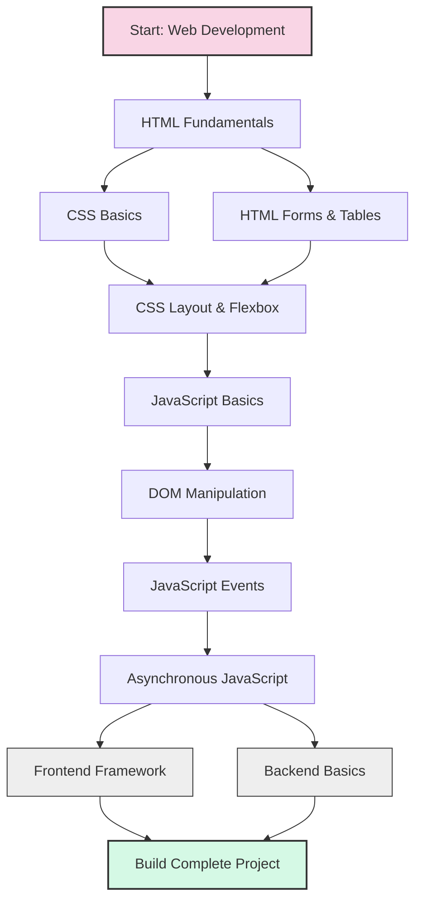
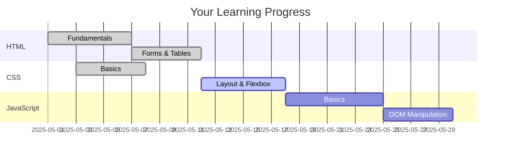

# Day 6: Learning Coach Agent - User Guide

Welcome to the Learning Coach Agent! This guide will help you understand how to effectively use the agent to enhance your learning experience, whether you're focused on academic subjects or professional skills development.

## Table of Contents

1. [Introduction](#introduction)
2. [Getting Started](#getting-started)
3. [Core Features](#core-features)
4. [Supported Learning Types](#supported-learning-types)
5. [Common Commands and Queries](#common-commands-and-queries)
6. [Tips for Effective Use](#tips-for-effective-use)
7. [Troubleshooting](#troubleshooting)
8. [Advanced Usage](#advanced-usage)
9. [Frequently Asked Questions](#frequently-asked-questions)

## Introduction

The Learning Coach agent is an AI-powered assistant designed to help you create personalized learning paths, track your progress, discover quality educational resources, and test your knowledge through quizzes. It adapts to your learning style and pace, providing a customized experience that enhances your learning journey.

### Key Benefits

- **Personalized Learning Paths**: Get customized learning plans based on your goals, interests, and existing knowledge
- **Progress Tracking**: Monitor your advancement and receive reminders optimized for knowledge retention
- **Resource Discovery**: Find high-quality educational content from trusted sources
- **Interactive Assessments**: Test your knowledge with adaptive quizzes and get immediate feedback
- **Flexible Learning**: Learn at your own pace across multiple subjects or skills

## Getting Started

### Installation

1. Clone the repository:
   ```
   git clone <repository-url>
   cd agents/Day-06-Learning-Coach/app
   ```

2. Install dependencies using uv:
   ```
   uv venv
   source .venv/bin/activate  # On Windows: .venv\Scripts\activate
   uv pip install -e .
   ```

3. Set up environment variables:
   ```
   cp .env.example .env
   # Edit .env with your API keys and configuration
   ```

4. Launch the backend:
   ```
   python main.py
   ```

5. In a separate terminal, set up and run the React frontend:
   ```
   cd frontend
   npm install
   npm start
   ```

### Initial Configuration

When you first launch the Learning Coach, you'll need to:

1. **Create a profile**: Enter your name, interests, and learning preferences
2. **Set learning goals**: Define what you want to learn and your timeline
3. **Take a learning style assessment**: Help the agent understand how you learn best

## Core Features

### Learning Path Creation

Create personalized step-by-step learning plans for any subject or skill.

Example learning path for Web Development:



To create a new learning path:
1. Click "Create New Path" or type "I want to learn [subject]"
2. Specify your goal and current knowledge level
3. Review and customize the generated path
4. Save and begin learning!

Paths will automatically be sequenced with prerequisites and organized into logical modules.

### Progress Tracking

Monitor your advancement through learning paths with detailed tracking.

Features include:
- Visual progress dashboard
- Completion percentages for each topic
- Time spent learning
- Quiz performance metrics
- Spaced repetition reminders



### Resource Discovery

Find high-quality learning materials tailored to your needs.

The Learning Coach can recommend:
- Open educational resources
- Free textbooks and courses
- Articles and tutorials
- Videos and interactive content
- Practice exercises

All resources are evaluated for quality and relevance to your specific learning goals.

### Quiz Generation

Test your knowledge with adaptive quizzes.

Quiz features:
- Questions tailored to your learning progress
- Multiple formats (multiple choice, short answer, etc.)
- Immediate feedback and explanations
- Difficulty that adapts based on your performance
- Identification of knowledge gaps

## Supported Learning Types

### Academic Subjects

The Learning Coach supports a wide range of academic subjects, including:

- **Mathematics**: All levels from basic arithmetic to advanced calculus
- **Sciences**: Physics, Chemistry, Biology, Earth Science
- **Humanities**: History, Literature, Philosophy
- **Languages**: Learning vocabulary, grammar, and communication skills
- **Computer Science**: Programming, algorithms, data structures
- **Social Sciences**: Psychology, Sociology, Economics

### Professional Skills

Develop career-related skills with structured learning paths:

- **Programming Languages**: Python, JavaScript, Java, C++, etc.
- **Data Science**: Statistics, machine learning, data visualization
- **Business Skills**: Management, marketing, finance
- **Design**: UX/UI, graphic design, web design
- **Project Management**: Methodologies, tools, certification prep
- **Soft Skills**: Communication, leadership, time management

## Common Commands and Queries

Here are some examples of how to interact with the Learning Coach:

### Learning Path Creation
- "I want to learn Python programming from scratch"
- "Create a learning path for machine learning"
- "Help me prepare for the GMAT exam"
- "Design a study plan for learning Spanish"

### Resource Requests
- "Find me resources to learn about climate change"
- "What are the best books to learn calculus?"
- "Show me interactive tutorials for JavaScript"
- "Recommend videos about photosynthesis"

### Progress Management
- "Update my progress on the Python path"
- "Mark module 3 as complete"
- "Show me my overall progress"
- "What should I study next?"

### Knowledge Testing
- "Create a quiz on the material I've learned so far"
- "Test my knowledge of organic chemistry"
- "Generate practice problems for linear algebra"
- "I want to review concepts I'm struggling with"

### Explanations and Help
- "Explain the concept of recursion"
- "I'm confused about the Krebs cycle"
- "Can you simplify the explanation of quantum mechanics?"
- "Help me understand the difference between affect and effect"

## Tips for Effective Use

### Setting Realistic Goals
- Break large learning goals into smaller, manageable objectives
- Be specific about what success looks like
- Set reasonable timeframes for completion

### Regular Engagement
- Schedule consistent learning sessions
- Use the progress tracking to maintain momentum
- Respond to spaced repetition prompts to reinforce learning

### Active Learning
- Take notes while studying resources
- Apply concepts through practice exercises
- Teach what you've learned to someone else

### Feedback Loop
- Rate resources that were particularly helpful
- Provide feedback on quiz questions
- Update your learning preferences as needed

## Troubleshooting

### Common Issues

**Problem**: Learning path seems too advanced
**Solution**: Request to "simplify my learning path" or "adjust difficulty level"

**Problem**: Not finding relevant resources
**Solution**: Try more specific queries or adjust your search terms

**Problem**: Progress not updating
**Solution**: Ensure you explicitly mark items as complete

**Problem**: Quiz questions are too easy/difficult
**Solution**: Ask to "adjust quiz difficulty" or be more specific about the level you need

## Advanced Usage

### Custom Learning Path Templates
Create templates for recurring learning needs:
```
create template "Weekly Language Learning" with:
- vocabulary acquisition
- grammar practice
- listening exercise
- speaking practice
```

### Integration with Calendar
Connect to your calendar for scheduled learning:
```
schedule "Python learning" for 30 minutes every Tuesday and Thursday at 6pm
```

### Learning Analytics
Generate detailed reports on your learning patterns:
```
generate learning report for the past 3 months
```

### Collaborative Learning
Share paths with friends or colleagues:
```
share my "Data Science Fundamentals" path with example@email.com
```

## Frequently Asked Questions

**Q: Can I learn multiple subjects at once?**
A: Yes! The Learning Coach can manage multiple learning paths simultaneously. However, we recommend focusing on 2-3 areas at most for optimal results.

**Q: How does the spaced repetition system work?**
A: The agent uses the SM-2 algorithm to schedule reviews at optimal intervals for memory retention. After each quiz, it adjusts the timing of future reviews based on your performance.

**Q: Can I import existing learning materials?**
A: Yes, you can upload your own resources or link to external content. Use "add resource [URL] to my [subject] path" to include it in your learning plan.

**Q: What if I need to take a break from learning?**
A: Use the "pause my learning path" command. The agent will remember your progress and you can resume at any time with "resume my learning path."

**Q: How does the agent know what resources are best?**
A: The Learning Coach evaluates resources based on quality indicators, user ratings, and alignment with your specific learning goals and preferences.

**Q: Can I use the Learning Coach without internet?**
A: Basic functionality is available offline, but resource discovery and some advanced features require internet connectivity.

## Conclusion

The Learning Coach agent is designed to be your personalized guide through any learning journey. By leveraging its features and following the recommendations in this guide, you can make your learning more efficient, effective, and enjoyable.

Remember, the most successful learners are those who engage consistently and actively with the material. Let the Learning Coach help you develop not just knowledge, but also the metacognitive skills to become a lifelong learner.

Happy learning!